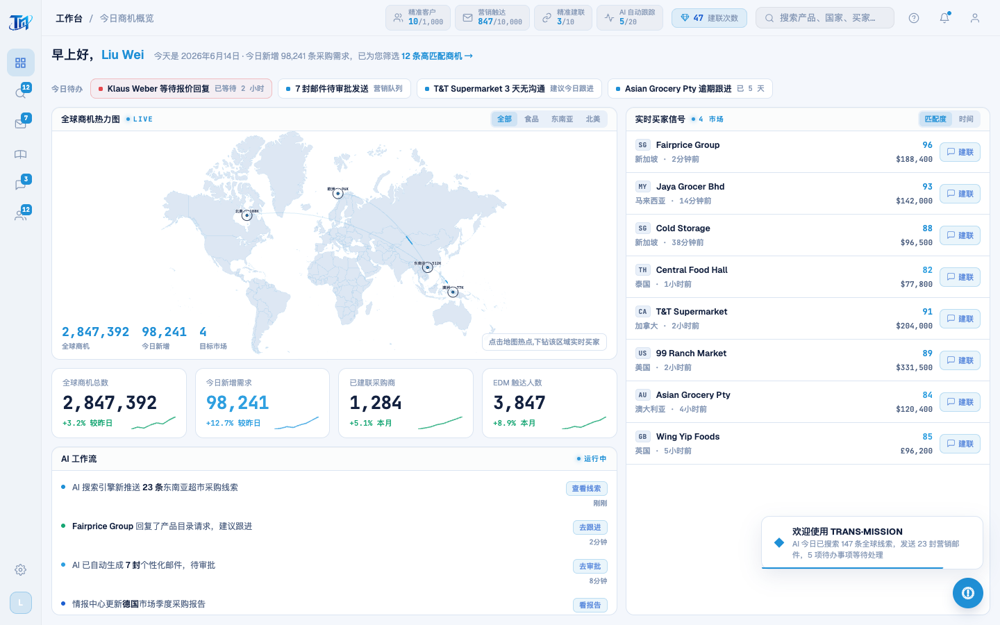
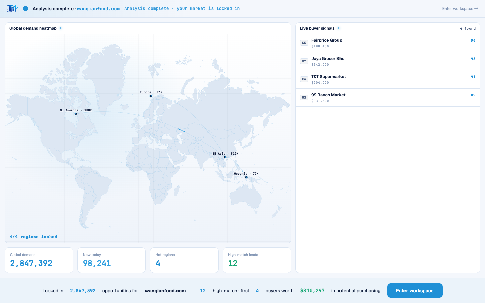

# Round 065 · 🟦 产品轴 · 地图交互/游戏感:活的贸易信号网络(航线弧+信号流动)+ hover 响应

- 时间:2026-06-25
- 档位:🟦 Standard(`main`;cron 1min)
- 分支:`main`
- backlog 来源项:用户新增焦点 ④「地图要有交互感、甚至一点游戏感」。WorldHeatmap 是 dashboard+开头动画共用组件,一次改两处受益。

## 做了什么(走品牌 Signal Room「transmission」路线,零 slop)
1. **活的贸易/信号网络**:从枢纽(hot 区=SE Asia)向其它区画**航线弧**(二次贝塞尔,上拱 flight-path 风),每条弧上有一段 azure 信号**沿线流动**(`pathLength=100` 归一 + `stroke-dashoffset` 动画,错峰 delay)= 全球 transmission 网络的「游戏/网络地图」感。faint 底弧 + 亮 azure 流动信号,克制。
2. **热点 hover 响应(交互感)**:hover/选中 → azure 响应环淡入(`.wh-ring` opacity)+ 圆点放大 r5 + 标签转 royal。光标 pointer。
3. 都呼应 logo 轨道 + 既有 sonar ping;`prefers-reduced-motion` 停流动;无 glow/渐变 slop。

## 验收
- **build** ✓ · **机检** dashboard/analysis `newErrors:[]` ✓ · **golden h3** ✓(**修复**:hover 环初版 `transform:scale+transform-origin:center` 在 SVG 里令 spot bbox 漂移,Playwright force 点击落空→下钻挂;改 opacity-only 后下钻恢复)· **h1** ✓ · **tour-check** ✓
- **实拍**:dashboard 地图 SE Asia 枢纽→各区航线弧+流动信号;开头动画 FRA 同样有弧(共用组件,顺带强化焦点②)。
- **两北极星裁决**:视觉 —— 游戏/交互感靠 azure 贸易网络 + hover 响应(on-brand transmission,克制),非 glow/撞色 slop;产品 —— 地图更活、更可玩。**KEEP。**

## 截图
- (工作台贸易网络)· (开头动画同款弧+英文)

## 残留 → backlog
- 可选(更强游戏感):点击热点的 ripple 反馈、信号沿弧到达时热点 pulse、悬浮 region tooltip 富信息。
- ① 逐屏英文化主战场(dashboard/leads/intel/wa/营销/池/tour/toast/legacy 大量串)仍是大头。

## commit / 分支 / push
- commit on `main` · push origin main。**cron 1min 起搏,不 ScheduleWakeup。**
