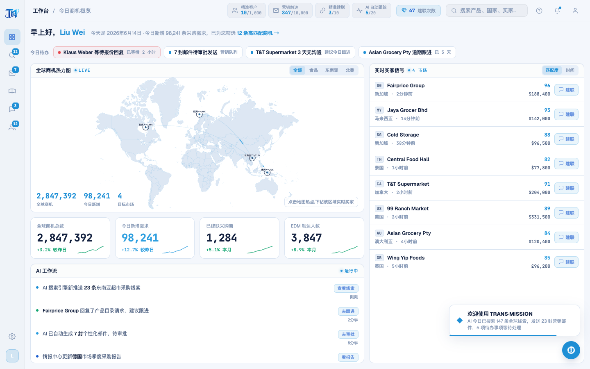
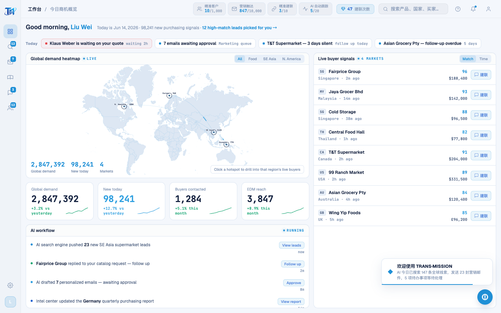

# Round 066 · 🟦 产品轴 · 工作台 dashboard 全文案英文化

- 时间:2026-06-25
- 档位:🟦 Standard(`main`;cron 1min)
- 分支:`main`
- backlog 来源项:用户焦点 ① 全站英文。承 R063(登录)/R064(开头动画),本轮主屏 dashboard。

## 做了什么
DashboardPage 所有**可见文案** → 英文,内部匹配键保持以不破坏下钻/golden:
- 问候:Good morning, Liu Wei / Today is Jun 14, 2026 · 98,241 new purchasing signals · 12 high-match leads picked for you →
- 今日待办:Today + 4 条(Klaus Weber is waiting on your quote / 7 emails awaiting approval / T&T Supermarket — 3 days silent / Asian Grocery Pty — follow-up overdue)
- 地图:Global demand heatmap · All/Food/SE Asia/N. America · map-stat(Global demand/New today/Markets)· hint "Click a hotspot to drill into that region's live buyers";热点 label(SE Asia · 512K 等)
- KPI:Global demand / New today / Buyers contacted / EDM reach + delta(vs yesterday / this month)
- AI workflow:feed 5 条英文 + 行动(View leads/Follow up/Approve/View report/View accounts)
- 实时买家:Live buyer signals · 4 markets · 买家 sub(Singapore · 2m ago 等)· Match/Time · region-clear
- **内部键保留**:`region`('东南亚'…)作下钻匹配键不变 → 加 `regionLabel` 映射做英文展示(drill 头显 SE Asia);买家 country/need/flag(仅喂 connectBuyer→WA seed,WA 仍中文,下轮处理)保留。
- **harness**:h3-golden 热点筛选 `hasText '东南亚'→'SE Asia'`(label 已变)。

## 验收
- **build** ✓ · **机检** dashboard `newErrors:[]` ✓ · **golden h3** ✓(下钻=4 + WhatsApp 开 + seed 仍中文 regex 通过)· **h1** ✓ · **tour-check** ✓(引导按 class 定位,文案变不影响)
- **实拍**:dashboard 全英文 + 贸易网络弧保留。
- **两北极星裁决**:产品 —— 英文化(国际/demo);视觉 —— 无变。**KEEP。**

## 截图
-  → 

## 残留 → backlog(英文化主战场续)
- **app shell(高杠杆,每屏可见)**:TopBar(搜索框/建联次数/通知/profile toast 文案)、QuotaBar(精准客户/营销触达/精准建联/AI 自动跟踪 + 充值)、SidebarNav 各项 tooltip(工作台/找客户/情报中心/WhatsApp/营销/客户池)、欢迎 toast。
- **legacy 渲染页(大量中文串)**:leads/intel/whatsapp/marketing/pool(public/legacy-app.js)+ 引导 tour 文案 + 各 toast。
- 死 UI rso 中文(T11,不碰)。connectBuyer WA seed + 买家 country/need(随 WA 屏英文化)。

## commit / 分支 / push
- commit on `main` · push origin main。**cron 1min 起搏,不 ScheduleWakeup。**
