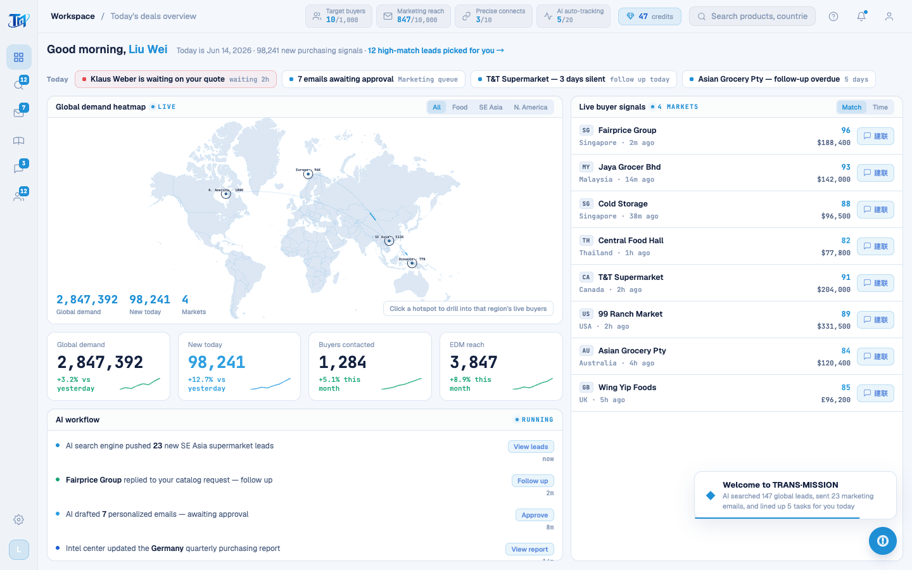

# Round 067 · 🟦 产品轴 · app shell 英文化(高杠杆:每屏可见)

- 时间:2026-06-25
- 档位:🟦 Standard(`main`;cron 1min)
- 分支:`main`
- backlog 来源项:焦点 ① 全站英文。承 dashboard(R066),本轮 **app shell**(每屏可见,杠杆最高)。

## 做了什么(壳层所有可见文案 → 英文)
- **TopBar**:breadcrumb(Workspace / Today's deals overview)· credits toast + label(Connect credits / "47 credits" / cost 1 credit each)· 搜索框(Search products, countries, buyers…)· 引导 title(Guided tour)· 通知 toast(Notifications / Klaus Weber replied to your quote · new Germany lead · 7 emails to approve)· profile toast(Liu Wei / Wanqian Foods · South China Sales Director · signed in)。
- **SidebarNav** tooltips:Workspace / Find buyers / Marketing / Intel center / Deals / Customer pool / Settings(+ Settings toast "Coming soon")。
- **QuotaBar**:quota labels(Target buyers / Marketing reach / Precise connects / AI auto-tracking)+ desc + recharge toast(Top up… / We'll add…)+ 下拉(Quota top-up / Close / Used / + Top up)。
- **legacy**:`PAGE_NAMES`/`PAGE_SUBS`(各屏 tb-page/tb-sub 标题)+ 欢迎 toast(Welcome to TRANS·MISSION · AI searched 147 global leads, sent 23 marketing emails, and lined up 5 tasks for you today)。

## 验收
- **build** ✓ · **机检** dashboard 零错✓ · **golden h3** ✓ · **h1** ✓ · **tour-check** ✓(引导按 class,不受文案影响)
- 壳层残留中文仅代码注释(非用户可见)。
- **实拍**:dashboard 壳层(breadcrumb/QuotaBar/credits/搜索/欢迎 toast)全英文。
- **两北极星裁决**:产品 —— 壳层英文(每屏一致);视觉 —— 无变。**KEEP。**

## 截图
- (TopBar/QuotaBar/credits/搜索/欢迎 toast 英文)

## 残留 → backlog(英文化主战场:legacy 页内容)
- **legacy 渲染页**(public/legacy-app.js 大量中文串):找客户(ICP/数据源/enrich/任务)· 情报中心(表格/解锁/状态)· WhatsApp(联系人/聊天/话术/情报面板/WA seed)· 营销(队列/审批/邮件正文)· 客户池(状态/跟进/详情)· 各 toast · INTEL/MKT/CPOOL/数据数组。
- **引导 tour** 文案(GuidedTour.vue 步骤 + nudge,中文)。
- buyer country/need(随 WA 屏)· 死 UI rso(T11 不碰)。

## commit / 分支 / push
- commit on `main` · push origin main。**cron 1min 起搏,不 ScheduleWakeup。**
