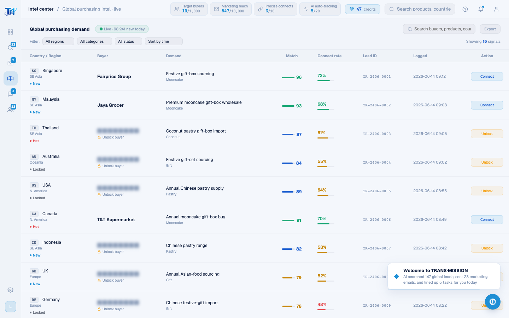

# Round 068 · 🟦 产品轴 · 情报中心 intel 全文案英文化

- 时间:2026-06-25
- 档位:🟦 Standard(`main`;cron 1min)
- 分支:`main`
- backlog 来源项:焦点 ① 全站英文。承 shell(R067),本轮 **情报中心**(legacy 渲染页主战场第一站)。

## 做了什么(intel 屏所有可见文案 → 英文)
- **IntelPage.vue 标记**:页头(Global purchasing demand / Live · 98,241 new today)· 搜索(Search buyers, products, countries…)· 导出(Export / Export data toast / Generating Excel report…)· 筛选条 Filter: + 4 个 select 的 option 文案(All regions/SE Asia/N. America/Oceania/Europe/Middle East · All categories/Mooncake/Coconut/Pastry/Gift sets · All status/New/Hot/Locked · Sort by time/match/amount)· 计数 Showing N signals · 8 表头(Country / Region · Buyer · Demand · Match · Connect rate · Lead ID · Logged · Action)。
- **INTEL_TABLE_DATA(15 行)**:country(Singapore…South Korea)· region · need(15 条需求描述)· cat —— 全英文。**region/cat 值与筛选 option 值一致翻译**(SE Asia / Mooncake…),筛选匹配键保持同步(红线:内部匹配键同步)。
- **renderIntelTable 渲染串**:statusCfg label(New/Hot/Locked)· 空态(No matching demand)· 锁定行打码副标(Unlock buyer)· 行内按钮(Unlock / Connect)· 行点击 + Connect toast(Outreach started / AI is drafting a personalized opener for ${buyer}…)。
- **解锁弹窗 modal-unlock(AppModals.vue)**:Unlock deep intel + 副标 + 两档(Single unlock / Monthly unlimited)+ 描述 + ¥99/mo + Cancel / Unlock now。
- **confirmUnlock toast(legacy)**:Deep intel unlocked / Intel unlocked + "… connect credits left"。

## 验收
- **build** ✓ · **机检** intel 零错✓(pass:true,pageErrors:[])· **golden h3** ✓(rows=4,下钻不破)· **h1** ✓ · **tour-check** ✓
- intel 屏残留中文仅 2 行代码注释(非用户可见)。
- **实拍**:情报中心表格 + 筛选条 + 表头全英文。
- **两北极星裁决**:产品 —— intel 整屏英文(表格/筛选/解锁链路一致);视觉 —— 无变。**KEEP。**

## 截图
- 

## 残留 → backlog(英文化继续)
- **引导 tour**(GuidedTour.vue 12 步 + nudge,仍中文 —— tour-check 按 class 不受影响,但用户可见)。**下一轮高杠杆候选**。
- legacy 余页:找客户 leads(ICP/数据源/任务)· WhatsApp(联系人/聊天/话术/情报面板/WA seed → 需同步 h3-golden 种子正则 `/采购|供应商|报价/`)· 营销(队列/审批/邮件正文)· 客户池(状态/跟进/详情)。

## commit / 分支 / push
- commit on `main` · push origin main。**cron 1min 起搏,不 ScheduleWakeup。**
