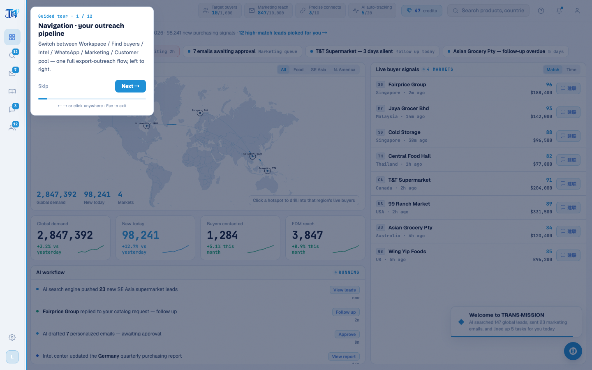

# Round 069 · 🟦 产品轴 · 引导 tour 全文案英文化

- 时间:2026-06-25
- 档位:🟦 Standard(`main`;cron 1min)
- 分支:`main`
- backlog 来源项:焦点 ① 全站英文。承 intel(R068),本轮 **引导 tour**(跨全屏可见,新用户第一触点,高杠杆)。

## 做了什么(GuidedTour.vue 所有可见文案 → 英文)
- **12 步 title/desc**:Navigation·your outreach pipeline / Today's tasks·start here / Global demand heatmap / Core metrics / Live buyer signals·connect in one click / AI workflow / Find buyers·AI lead-gen / Intel center·global demand / Outreach chat·AI script assist / Marketing queue·personalized at scale / Customer pool·follow-up overview / That's it·start reaching out —— 每步真实解释对应功能(红线:真实内容,非占位)。
- **卡片 UI**:step 标签 Guided tour · N / 12 · Skip · Back · Next →/Done · hint(← → or click anywhere · Esc to exit)。
- **首访提示 nudge**:Guided tour / First time at TRANS·MISSION? / Take 30 seconds to see how it finds you global buyers and connects in one click. / No thanks / Start tour →。

## 验收
- **build** ✓ · **tour-check** ✓(12/12 步 spotlight 命中 + 有标题,总步数读到 12;step 标签保 `· N / 12` 格式,harness 计数正则不破)· **golden h3** ✓(rows=4)· **h1** ✓
- tour 残留中文仅代码注释(非用户可见)。
- 坑:perl 模式里 `TRANS·MISSION?` 的 `?` 被当量词,漏掉原 `?`→输出 `??`,已修。
- **两北极星裁决**:产品 —— 引导全英文(新用户第一触点一致);视觉 —— spotlight/卡片样式无变。**KEEP。**

## 截图
- (step 1 spotlight + 英文卡片)

## 残留 → backlog(英文化继续:legacy 渲染页内容)
- **找客户 leads**(ICP/数据源/enrich/任务串)· **WhatsApp**(联系人/聊天/话术/情报面板/WA seed → 翻译 WA seed 时须同步 `scripts/h3-golden.mjs` 种子正则 `/采购|供应商|报价/`)· **营销 marketing**(队列/审批/邮件正文)· **客户池 pool**(状态/跟进/详情)· 各 toast · INTEL_DATA(wa 面板)/MKT/CPOOL 数据数组。
- buyer country/need(随 WA 屏一并)。死 UI rso(T11 不碰)。

## commit / 分支 / push
- commit on `main` · push origin main。**cron 1min 起搏,不 ScheduleWakeup。**
