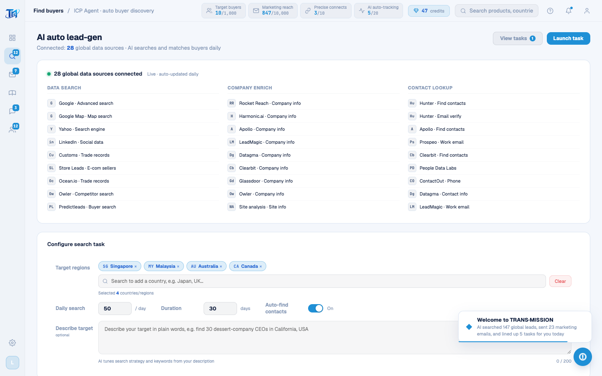

# Round 070 · 🟦 产品轴 · 找客户 leads 页 UI 英文化(markup + RG 国家系统)

- 时间:2026-06-25
- 档位:🟦 Standard(`main`;cron 1min)
- 分支:`main`
- backlog 来源项:焦点 ① 全站英文。承 tour(R069),本轮 **找客户 leads**(拓客流水线入口,整屏)。

## 做了什么(leads 页 UI chrome → 英文)
- **LeadsPage.vue 三视图 markup 全译**:
  - **数据源视图**:页头(AI auto lead-gen / 28 global data sources connected · …daily / View tasks / Launch task)· 28 源面板三列(Data search / Company enrich / Contact lookup + 各源后缀 Advanced search/Map search/Yahoo/Search engine/LinkedIn/Social data/Customs/Trade records/E-com sellers/Competitor search/Buyer search/Company info/Site analysis/Find contacts/Email verify/Work email/Phone/Contact info,海 logo→Cu)· 配置表单(Configure search task / Target regions / 续 placeholder / 大洲 tabs All·SE Asia·N.America·Europe·Oceania·Middle East·E.Asia·S.America·Africa / Clear / Selected N countries / Daily search · /day / Duration · days / Auto-find contacts · On / Describe target + placeholder + AI tunes…)。
  - **任务视图**:Active tasks / New task / Daily auto lead-gen · SE Asia + N.America + Oceania / Running / All connected sources·50/day·14 of 30 days·auto-find contacts on / 4 stat(Buyers found/Contacts found/In marketing queue/Days left)/ View buyers / Pause(+任务已暂停 toast)/ Task progress 14/30 days / Live incoming buyers / AI searches and pushes every minute / View all。
  - **客户视图**:Back to tasks / Buyers pushed / Find contacts / Market for me / AI autopilot / 4 filter(All/Need contacts/Contacts found/Marketed)/ 6 表头(Company·Country / Profile / Source / Match / Contact / Action)。
- **RG 国家系统(红线:内部匹配键同步)**:`RG_COUNTRIES` 45 国 name 全译;4 个预置 rg-tag 的 **display + data-country 一并译**(Singapore/Malaysia/Australia/Canada);`renderRgCountryList` 空态(No matching country)。**`data-country` 是 toggleRgCountry 去重键(L1780 querySelector `[data-country=name]`),seed/RG_COUNTRIES/addRgTag 三处同步,增删/去重不破。**
- **leads chrome JS toast**:submitIcpTask(Task launched / ICP Agent started · {daily} buyers/day for {days} days)· icp-toggle label(On — AI auto-enriches email and phone / Off — unlock contacts manually)。

## 验收
- **build** ✓ · **机检 leads** 零错✓(pass,pageErrors:[])· **h1** ✓ · **h3**(rows=4)✓ · **tour-check** ✓
- leads UI 残留中文仅代码注释。
- **实拍**:数据源视图(页头/28 源三列/配置表单/大洲 tabs)全英文。
- **两北极星裁决**:产品 —— leads UI chrome 整屏英文 + RG 增删一致;视觉 —— 无变。**KEEP。**

## 截图
- 

## 残留 → backlog(leads 页数据层,下轮 R071)
- **LEADS_PUSH_DATA**(id:8 等,product/insight/tags 中文)+ `renderLeadsPush`(task-live-feed 行)+ `renderLeadsCustomers`(icp-cust-list 客户行 industry/desc/source/contacts title)+ COMPANY 详情数据(L1101+)+ enrich/autoExecute/pushSelectedToEdm toast。
- 之后:WhatsApp(联系人/聊天/话术/情报面板/**WA seed → 同步 h3-golden 种子正则 `/采购|供应商|报价/`**)· 营销 · 客户池。

## commit / 分支 / push
- commit on `main` · push origin main。**cron 1min 起搏,不 ScheduleWakeup。**
