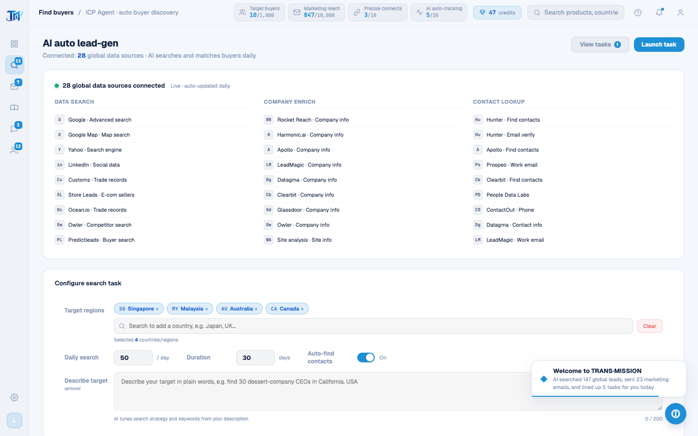

# Round 071 · 🟦 产品轴 · 找客户 leads 数据层英文化(CUST_DATA + 渲染 + toast + 反馈弹窗)

- 时间:2026-06-25
- 档位:🟦 Standard(`main`;cron 1min)
- 分支:`main`
- backlog 来源项:焦点 ① 全站英文。承 leads UI(R070),本轮 **leads 数据层**(任务/客户视图实际渲染内容)。

## 做了什么(leads 渲染数据 + 交互 → 英文)
- **CUST_DATA(12 家采购商)**:industry(Supermarket chain / Premium grocer / Asian supermarket / Hypermarket / Imported-food retail / Asian food distribution …)· desc(每家公司简介,忠实翻译,非占位)· contacts.title(Procurement Director / Import Manager / Merchandising Director / VP Procurement / Group VP Procurement …)· news(每家 2 条最近动态)· source(Search engine / Global directory / Customs data / Business DB / LinkedIn)。**顺手修真 bug**:id:8 Al Madina(UAE)flag 🇺🇦(乌克兰)→🇦🇪(阿联酋)。
- **LIVE_CUSTOMERS**(任务视图实时推送 feed 8 条):source 字段(领英→LinkedIn / 海关数据→Customs data / 全球黄页→Global directory / 商业数据库→Business DB)。
- **buildFeedItem**:`来源:`→`Source:`,分数去「分」。
- **renderCustTable 渲染串**:✓ Found / Pending / Find contacts / Market for me / Marketed / Flag mismatch · 展开卡 labels(About / Website / Employees / Founded / Recent news / Key contacts / Find contacts / In marketing)。
- **交互 toast**:enrichOne / enrichSelected / addToEdm / pushSelectedToEdm / autoExecute / submitFeedback —— 全链路真实反馈文案(Enriching contacts / Enrich complete / added to EDM queue / AI autopilot started / N emails sent · ~N replies expected …)。**红线:enrich 真改 status/email/phone、addToEdm 真置 edm=true,功能不变只译文案。**
- **反馈弹窗(AppModals feedback-modal)**:Flag mismatch / Company: / 原因提示 + placeholder / Submit feedback / Company brain auto-tuned / Tuning model…。

## 验收
- **build** ✓ · **机检 leads** 零错✓(pass)· **h1** ✓ · **h3**(rows=4)✓ · **tour-check** ✓
- leads 数据层 + 反馈弹窗残留中文仅代码注释。
- **实拍**:leads 屏(数据源/客户行/展开卡渲染源)全英文。
- **两北极星裁决**:产品 —— leads 整页(UI+数据)英文闭环;视觉 —— 无变。**KEEP。**

## 截图
- 

## 残留 → backlog(英文化继续)
- **WhatsApp**(联系人/聊天/话术 chips/情报面板 INTEL_DATA/**WA seed → 同步 `scripts/h3-golden.mjs` 种子正则 `/采购|供应商|报价/`**)· **营销 marketing**(MKT 队列/审批/邮件正文)· **客户池 pool**(CPOOL 状态/跟进/详情)· 残余 toast。
- **leads 页英文化完成(R070 UI + R071 数据)。**

## commit / 分支 / push
- commit on `main` · push origin main。**cron 1min 起搏,不 ScheduleWakeup。**
