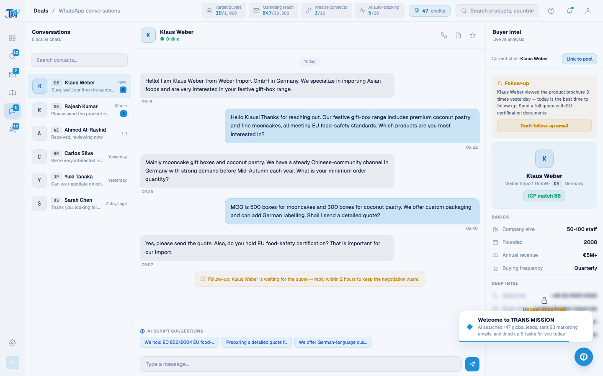

# Round 072 · 🟦 产品轴 · WhatsApp 商机中心英文化(含 WA seed + h3 正则同步)

- 时间:2026-06-26
- 档位:🟦 Standard(`main`;cron 1min)
- 分支:`main`
- backlog 来源项:焦点 ① 全站英文。承 leads(R070/071),本轮 **WhatsApp 商机中心**(H3 黄金路径终点,最敏感:连建联 seed 受 h3 断言约束)。

## 做了什么(WA 屏所有可见文案 → 英文)
- **WhatsAppPage.vue markup**:Conversations / 6 active chats / Search contacts… / 三工具 toast(Voice call·Profile·Mark important)/ AI script suggestions / Type a message… / Buyer intel / Live AI analysis / Current chat: / Link to pool。
- **WA_CONTACTS(6)**:last / time(now·10 min·1 h·Yesterday·2 days ago)/ **status `在线`/`离线`→`online`/`offline`(selectWaContact 比较键同步)**。
- **WA_CHATS[0]**(Klaus 整段中文对话)→ 英文 6 条;**chat 2 阿拉伯语 deliberately 保留**(真实阿语买家,非待译中文);chat 1 本就英文。
- **WA_CHIPS[0/1/2]**(AI 话术建议)→ 英文(EU/Halal 认证·新加坡仓储·CNY 折扣·阿语市场等)。
- **INTEL_DATA[0/1]** basic/locked keys(Company size/Founded/Annual revenue/Buying frequency/Direct line/Buyer email/Past spend/Decision cycle)+ followup(标题/正文/按钮)。
- **WA 渲染函数**:renderWaChat(Today)· useChip toast(AI script inserted)· sendWaMsg(4 条 reply + now ✓✓ + Reply received toast)· renderIntelPanel(Basics/Deep intel/ICP match/Unlock deep intel/¥29 each·¥99 monthly + 跟进邮件 toast)· selectWaContact(● Online/○ Offline)· linkWaToPool(Linked to pool / pool 跟进 toast)。
- **connectBuyer 动态 seed(红线:驱动 H3)**:新建联买家的对话 seed(inbound「we are sourcing a supplier for … pricing」)+ follow 提醒 + chips + INTEL_DATA + 建联 toast 全英文。
- **dashboard 买家数据(喂 WA seed)**:8 买家 country(Singapore…UK)+ need(Mid-Autumn mooncake gift boxes 等)译英;**region 保中文键**(下钻匹配),connect 调用改传 `regionLabel[b.region]` 让情报面板显英文。
- **harness 同步**:`h3-golden.mjs` seed 断言正则 `/采购|供应商|报价/` → `/sourcing|supplier|pricing|quote/i`(配合英文 seed)。

## 验收
- **build** ✓ · **机检 whatsapp** 零错✓(pass)· **h3 golden** ✓(rows=4 · **conversation seeded(英文 inbound)✓** · chips ✓)· **h1** ✓ · **tour-check** ✓
- WA 屏残留中文仅代码注释;chat 2 阿语为刻意真实买家。
- **实拍**:WhatsApp 联系人/对话/AI 话术/客户情报面板全英文。
- **两北极星裁决**:产品 —— H3 终点屏英文闭环 + 建联 seed 一致;视觉 —— 无变。**KEEP。**

## 截图
- 

## 残留 → backlog(英文化继续)
- **营销 marketing**(MKT_ITEMS / EMAIL_VARIANTS 邮件正文 / renderMktList 队列·审批 / INTEL_CENTER_CARDS / AI_MSGS)· **客户池 pool**(CPOOL_DATA 状态/跟进/详情)· 残余 toast。
- buyers `sub` 时间戳已英文;dashboard 其余早前已英文。

## commit / 分支 / push
- commit on `main` · push origin main。**cron 1min 起搏,不 ScheduleWakeup。**
