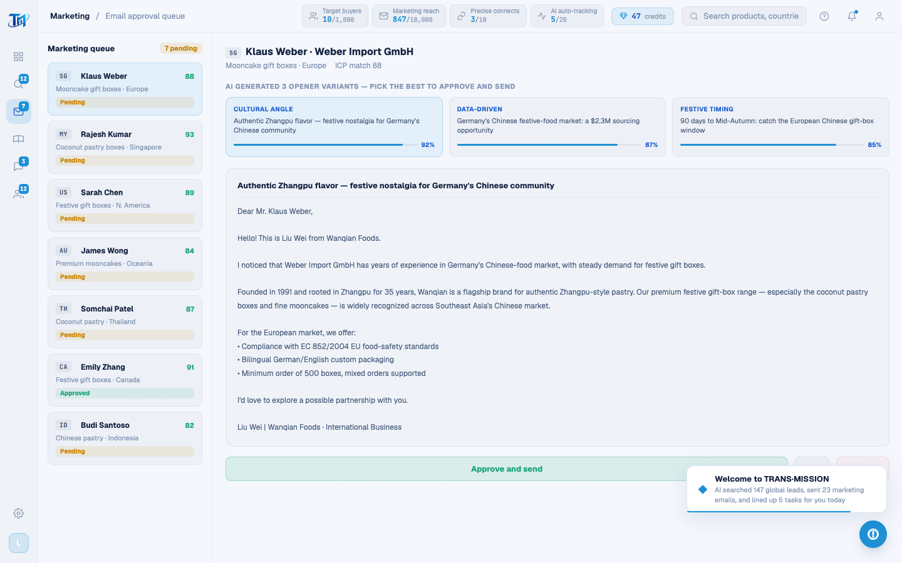

# Round 073 · 🟦 产品轴 · 营销队列 marketing + 情报中心卡 + AI feed 英文化

- 时间:2026-06-26
- 档位:🟦 Standard(`main`;cron 1min)
- 分支:`main`
- backlog 来源项:焦点 ① 全站英文。承 whatsapp(R072),本轮 **营销队列 + 关联数据块**(MKT/EMAIL/INTEL_CENTER/AI_MSGS/AI_DAILY)。

## 做了什么(营销屏 + 相关渲染数据 → 英文)
- **MarketingPage.vue**:Marketing queue / 7 pending / ← Select an email on the left to start。
- **MKT_ITEMS(7)**:product(Mooncake gift boxes · Europe / Coconut pastry boxes · Singapore …)。
- **EMAIL_VARIANTS[0](3 变体)**:hook(Cultural angle / Data-driven / Festive timing)+ subject + **完整邮件正文**(万仟 Wanqian Foods/Liu Wei/漳浦 Zhangpu 出海剧本,忠实翻译,非占位)。
- **renderMktList / selectMktItem**:score 去「分」· Pending/Approved · ICP match · "AI generated 3 opener variants…" · Approved · sent · Approve and send / Edit / ✕ Reject + 编辑 toast。
- **approveEmail / rejectEmail**:Approved · N pending · Email approved/rejected toast。
- **AI_MSGS(4)**:dashboard/feed 轮播提醒(Today/Signal/Queue/Follow-up,保留 <strong> 高亮)。
- **AI_DAILY_ITEMS(5)**:AI 日报(Global lead search/AI marketing sent/New connected buyers/New WhatsApp messages/Intel center update + value + detail)。
- **INTEL_CENTER_CARDS(4)**:title/sub/badgeText(New/Deep intel)/rows(Demand volume/Target products/Budget/Delivery/Annual contract/Decision maker/Contact)。
- **renderIntelCenter**:¥29 / ¥99 monthly · "Connected" toast · Connect now。

## 验收
- **build** ✓ · **机检 marketing** 零错✓(pass)· **h1** ✓ · **h3**(rows=4)✓ · **tour-check** ✓
- 营销屏 + 数据块残留中文仅代码注释。
- **实拍**:营销队列 + 邮件变体 + 邮件正文全英文。
- **两北极星裁决**:产品 —— 营销审批链路 + AI 日报/情报卡英文闭环;视觉 —— 无变。**KEEP。**

## 截图
- 

## 残留 → backlog(英文化收尾)
- **客户池 pool**(CPOOL_DATA 分组/状态 statusText/跟进/详情 + renderCpool/renderPoolTable + pool toast)—— **legacy 英文化最后一块**。
- 之后:全站 toast/字符串终扫 + 残余(死 UI rso 不碰)。

## commit / 分支 / push
- commit on `main` · push origin main。**cron 1min 起搏,不 ScheduleWakeup。**
