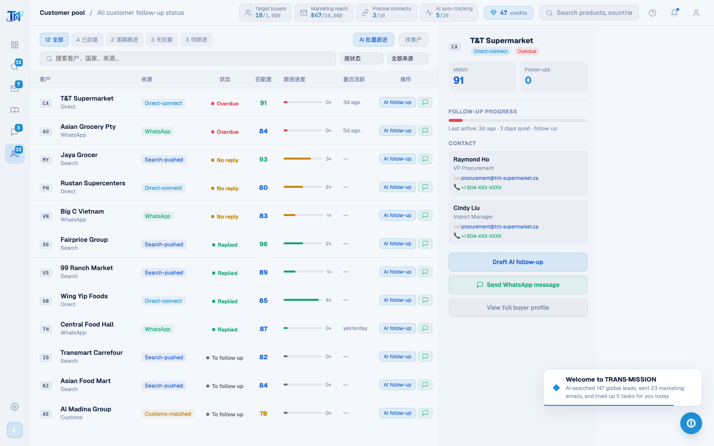

# Round 074 · 🟦 产品轴 · 客户池 pool 英文化(legacy 英文化收官页)

- 时间:2026-06-26
- 档位:🟦 Standard(`main`;cron 1min)
- 分支:`main`
- backlog 来源项:焦点 ① 全站英文。承 marketing(R073),本轮 **客户池 pool**——**legacy 渲染页英文化最后一块**。

## 做了什么(客户池所有可见文案 → 英文)
- **CPOOL_DATA**:4 分组 group(Search-pushed / Direct-connect / WhatsApp / Customs-matched)+ 12 条 statusText(Followed up N× · replied/no reply · Pushed · to follow up · N days quiet · follow up · New message yesterday · Matched · to contact)。**红线:group 是 POOL_SOURCE_MAP 匹配键 — 全局译保两处同步。**
- **解析函数同步(红线)**:`getPoolFollowCount` 正则 `/(\d+)\s*次/`→`/(\d+)\s*×/`(配合 statusText "N×");`getPoolLastActivity` 中文判定(刚刚/昨日/N天)→英文(now/yesterday/N days→"Nd ago")。
- **renderPoolTable / renderPoolCards / openPoolDetail 渲染串**:空态(No buyers / No matching buyers)· statusCfg label(Replied/Overdue/No reply/To follow up,3 套)· group 短标 ternary(Search/Direct/WhatsApp/Customs)· 单位(分→去、次→×)· Match / Follow-ups / Follow-up progress / Last active / Contact / No contact yet / ✓ Contact found / Enrich this buyer… / Draft AI follow-up / Send WhatsApp message / View full buyer profile / AI follow-up / Message。
- **toast**:openPoolDetail / poolFollowUp(AI follow-up started)/ 批量(AI bulk follow-up started)。

## 验收
- **build** ✓ · **机检 pool** 零错✓(pass,pageErrors:[])· **h1** ✓ · **h3**(rows=4)✓ · **tour-check** ✓
- 客户池残留中文仅代码注释。
- **坑(已修)**:perl 翻译 group 短标 ternary 时,`\?` 转义令 `? 'x' :` 变 `?? 'x'`(nullish 双问号)→ "Missing } in template expression" JS 报错 → 机检 pageError 抓到 → 改 `?? '`→`? '` 修复。**机检闸门起作用。**
- **实拍**:客户池分组/状态/跟进/详情全英文。
- **两北极星裁决**:产品 —— 客户池英文 + 解析键同步;视觉 —— 无变。**KEEP。**

## 截图
- 

## 里程碑
- **逐屏 legacy 页英文化全部完成(R068 intel · R069 tour · R070/071 leads · R072 whatsapp · R073 marketing · R074 pool)。** 叠加早前 R063 登录 · R064 开头动画 · R066 dashboard · R067 app shell。
- **残留 → 下轮:全站终扫**(零散 toast/showToast/confirm/alert/PAGE_NAMES 等遗漏串)+ 死 UI rso(T11 不碰)。

## commit / 分支 / push
- commit on `main` · push origin main。**cron 1min 起搏,不 ScheduleWakeup。**
