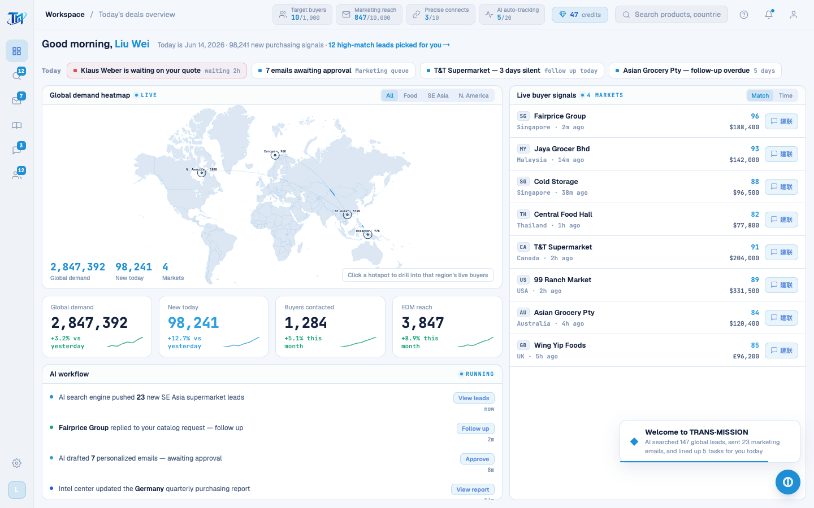

# Round 075 · 🟦 产品轴 · 全站英文终扫(剩余 live 文案 + 死代码甄别)

- 时间:2026-06-26
- 档位:🟦 Standard(`main`;cron 1min)
- 分支:`main`
- backlog 来源项:焦点 ① 全站英文。承 pool(R074,legacy 逐屏收官),本轮 **全站终扫** —— 两轴审计找剩余中文,逐一甄别 live vs 死代码。

## 做了什么(剩余 LIVE 可见文案 → 英文)
- **AiBubble.vue**(浮动 AI 助手,**每屏可见**):TR Assistant / ● Online / 今日提醒 msg(Klaus Weber…)/ 3 quick btns(Draft follow-up email / Launch ICP Agent / View pending replies)/ Another tip ↻。
- **AppModals modal-connect**(建联确认弹窗):Confirm connection / "AI will draft a personalized opener…" / "Uses 1 connect credit (47 left)" / Confirm connect。
- **doLogin**(登录按钮 live 态):Signing in… / Sign in。
- **aiAction toast**:Drafting follow-up email(draft 分支)。
- **WorldHeatmap.vue**:aria-label 全球商机热力图 → Global demand heatmap(无障碍,屏幕阅读器可见)。

## 死代码甄别(残留中文 = 不可达,按 T11「不碰死代码」跳过)
逐一验证 render 目标 / 消费者,确认以下**均不可达**,残留中文不影响任何 live 屏:
- **reg-scan-overlay(rso-* in LoginScreen.vue)** + `statuses`(legacy 251+):`startScan()` 早 return `window.__showAnalysis`(→ FirstRunAnalysis.vue R064),其后渲染分支死。
- **OnboardingScreen.vue + OB_CHAPTERS_MAP(382-503)+ advanceOb/enterApp**:旧首启,已被 H1 FirstRunAnalysis 取代;App.vue 挂载但永不激活。
- **AI_REPORT_ITEMS / TODAY_TODOS**(renderAiReport→`#ai-report-list`、renderTodayTodo→`#today-todo-list`):**DashboardPage.vue 注释明确旧面板已并入本页**(R066),目标 ID 不在 live DOM。
- **ICP_BUYERS / ICP_EDM_POOL**:无任何消费者(orphan)。
- **NEW_ACTIVITIES**(→`#activity-list`):`activity-list` 仅存于 dashboard.css,无 live markup。
- **LEADS**(legacy 11-20):无消费者(旧 dashboard 数据,被 DashboardPage buyers 取代)。

## 验收
- **build** ✓ · **机检 dashboard** 零错✓(AiBubble 在该屏)· **h1** ✓ · **h3**(rows=4)✓ · **tour-check** ✓
- **全站 LIVE 可见文案英文化达成**;残留中文全部位于经验证的不可达死代码,零用户可见。
- **两北极星裁决**:产品 —— 浮动助手/建联弹窗/登录态英文,全站闭环;视觉 —— 无变。**KEEP。**

## 截图
- 

## 里程碑 / 残留
- **★★ 焦点① 全站文案英文 —— LIVE 面全部完成**(R063 登录 / R064 开头 / R066 dashboard / R067 shell / R068 intel / R069 tour / R070-071 leads / R072 wa / R073 marketing / R074 pool / R075 浮动助手+弹窗+登录+终扫)。
- 残留(非 backlog,死代码):rso/onboarding/旧首启报告/orphan 数组 —— 若日后复活需补译,已在本报告登记。
- 可转下一焦点(②开头动画科技感 / ③登录酷炫 已 R063/064 做;或新方向待用户指示)。

## commit / 分支 / push
- commit on `main` · push origin main。**cron 1min 起搏,不 ScheduleWakeup。**
