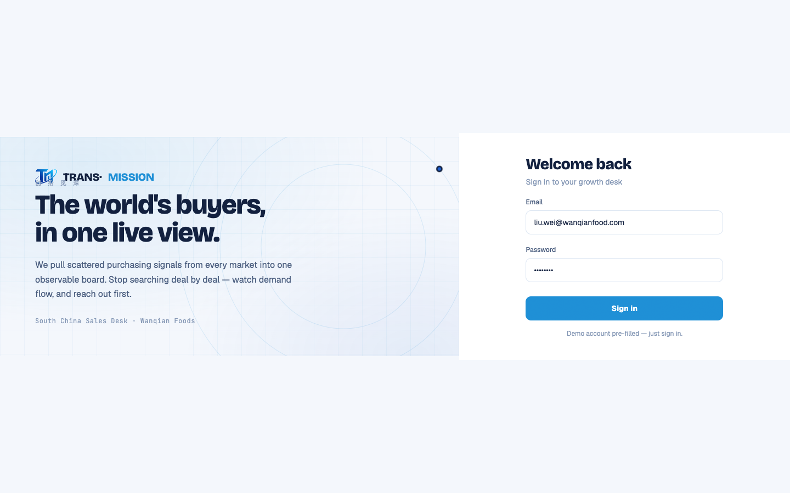

# Round 076 · 🟦 产品轴/Utility · T11 死代码清理(orphan 中文数据 + 旧 onboarding)

- 时间:2026-06-26
- 档位:🟦 Standard / Utility(`main`;cron 1min)
- 分支:`main`
- backlog 来源项:焦点 ① 全站英文已 R075 收官(live 面);本轮两轴审计发现 src/ 仅剩中文位于 **orphan 死代码** → 取 §8 **T11 删死代码**(预审已批,R038 确认)。

## 审计发现(为什么是这一项)
R075 后再做彻底 src/ 扫描,确认全站 LIVE 文案 0 中文;残留中文全部在:
- **`src/data/*.js`(5 文件)**:ai/intel/leads/marketing/whatsapp,export 中文数据数组,但 **0 import**(`grep "from '…/data/'"` = 0)—— 与 legacy-app.js live 数据重复的孤儿副本(计划中的 Vue 迁移未落地)。**潜在陷阱:日后复活即把中文请回。**
- **`OnboardingScreen.vue`**:旧首启章节屏,仅经 legacy `startScan` **dead 分支**(line 272 `s-onboard.active`)可达;live 路径 login→FirstRunAnalysis(R064)→`enterApp` 绕过它。含中文(正在分析…/跳过/下一章)+ 蓝渐变 glow 按钮(AI 味)。

## 做了什么(确认无引用后删 —— 红线:enterApp live 必保留)
- **删 5 个 orphan `src/data/*.js`** + 空目录(零 import,build 不含 → 零风险)。
- **删 `OnboardingScreen.vue`** + App.vue 的 `import` 与 `<OnboardingScreen />` mount。
- **保留**:`enterApp()`(FirstRunAnalysis done → App.vue finishAnalysis → window.enterApp,**live**);`onboarding.css`(`.ob-*` 可能与 legacy runOnboarding 共用,removal 需先核引用,**留待专轮**);legacy `runOnboarding`/`OB_CHAPTERS_MAP`/`.rso-*` 块(改 live 文件需谨慎)。

## 验收
- **build** ✓(app 主包 **97.3 → 93.7 KB**,gzip 25.3→23.9)· **机检 login** 零错✓ · **h1**(首启 login→FRA→enterApp,正是 OnboardingScreen 所在栈)✓ · **h3**(rows=4)✓ · **tour-check** ✓
- `grep OnboardingScreen src/` = 0 残留引用。
- **两北极星裁决**:产品 —— 删冗余死屏更整齐 + 消除「中文复活」陷阱;视觉 —— 旧 onboarding 蓝渐变 glop 随之移除。**KEEP。**

## 截图
- (login 完好)

## 残留 → backlog(T11 尾,见 §8 已更新)
- `onboarding.css`(先核 `.ob-progress-fill`/`.ob-action-num` 是否别处引用)+ legacy `runOnboarding`/`OB_CHAPTERS_MAP`/dead startScan 分支 + LoginScreen `.rso-*` 块(改 live 文件,专轮)。
- 这些残留 = 不可达死代码,**0 用户可见**(英文/视觉北极星不受影响)。

## commit / 分支 / push
- commit on `main` · push origin main。**cron 1min 起搏,不 ScheduleWakeup。**
