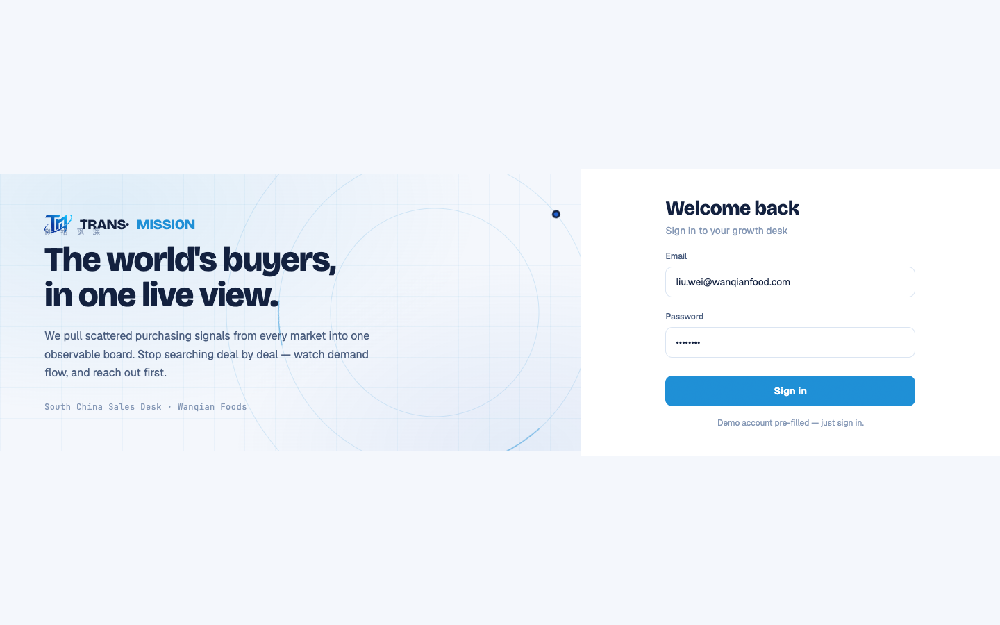

# Round 077 · 🟦 产品轴 · ③ 登录页 Signal-Room 动效再强化(更酷炫,零 slop)

- 时间:2026-06-26
- 档位:🟦 Standard(`main`;cron 1min)
- 分支:`main`
- backlog 来源项:用户 AskUserQuestion 选「②③ 再强化一轮(更酷炫)」。本轮取 **③ 登录**(每屏每会话可见,杠杆最高;现轨道母题偏静/偏淡)。

## 做了什么(登录左侧品牌栏 Signal-Room 母题 → 有生命的信号场)
现状:3 同心 azure 细环(.14)+ 2 慢速公转节点 —— 偏静、偏淡。**克制地加「活的信号」**:
- **信号扫掠弧 `.lg-sweep`**:中环(r=150)上一段短 azure 亮弧(stroke-dasharray 64/878)6s 绕行 —— 读作「数据沿轨道流动」(data flow / orbital motion),呼应地图雷达扫描扇区。opacity .5,1.5px,无 glow。
- **公转节点脉冲 `.lg-ping`**:主节点发软扩散环(scale 1→3.6 淡出,2.8s)—— 读作「轨道上的活信号」,**与工作台地图热点 ping 同一视觉语言**(全站 Signal Room 一致)。1.2px 描边环,非 glow 光晕。
- 细环 .14→**.16**(轻微提亮,母题更读得出,仍克制)。
- **prefers-reduced-motion**:扫掠/ping/公转全停,ping 透明 → 静态终态。

## 红线 / 零 AI 味自检(adversarial)
- **无 glow 光晕**:ping 是描边扩散环(雷达 ping),非 box-shadow/blur 光晕。
- **无俗气渐变 / 撞色**:纯单一 azure(var(--brand)),细描边;背景 radial 为既有极淡铺底未动。
- **不喧宾夺主**:动效全在左品牌栏(远离右侧表单);弧 6s 慢、ping faint。
- 走品牌「Signal Room 动感交易终端」路线(信号网格 + 轨道运动 + 数据流 + azure 信号动效)—— on-brand,非随机装饰。

## 验收
- **build** ✓ · **机检 login** 零错✓(pass,pageErrors:[])· **h1**(login 是首屏)✓ · **h3**(rows=4)✓ · **tour-check** ✓
- **实拍**:静帧见环更读得出 + 节点 ping 环;动效(扫掠绕行/节点脉冲)在 app 内给母题生命,静图不可全判,功能/构图为准。
- **两北极星裁决**:视觉 —— 更酷炫 + 守高级克制零 slop;产品 —— 登录第一印象更「动感交易终端」。**KEEP。**

## 截图
- 

## 残留 → backlog
- **② 开头动画 FirstRunAnalysis 再强化**(下一轮:同款克制 Signal-Room 动效语言,如信号流/扫掠,与本轮登录一致)。
- T11 尾(onboarding.css/legacy rso)未动。

## commit / 分支 / push
- commit on `main` · push origin main。**cron 1min 起搏,不 ScheduleWakeup。**
