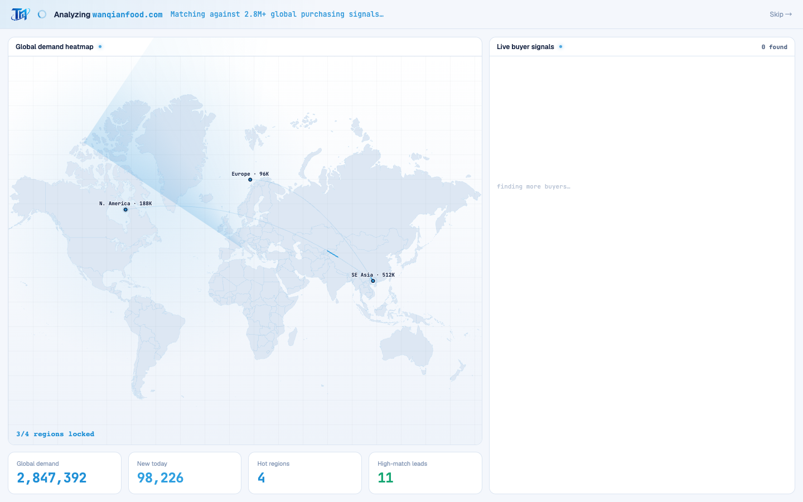

# Round 078 · 🟦 产品轴 · ② 开头动画 FirstRunAnalysis Signal-Room 动效再强化(科技感,零 slop)

- 时间:2026-06-26
- 档位:🟦 Standard(`main`;cron 1min)
- 分支:`main`
- backlog 来源项:承 R077(登录 ③ 再强化),用户「②③ 再强化一轮」之 **② 开头动画**。目标:与登录共享同一套 Signal-Room 动效语言(azure 扫掠 + 信号脉冲),让登录↔开头动画一致。

## 做了什么(FRA 三处,全部 CSS-only · 全部绑真实事件)
- **地图雷达扫描精修 `.fra-scan`**:原单段悬浮 conic 楔形(transparent→.14→transparent)→ **带余晖的真雷达扫掠**(亮前沿 .20 → 拖尾 .05@24deg → 透明@64deg,3.2s 绕行)。读作「声呐/雷达采集」前沿+afterglow,呼应登录轨道扫掠弧。完成即移除(v-if !done)。
- **KPI 锁定脉冲 `.fra-lock`**:每个 KPI 卡 `kpiOn` 点亮瞬间,顶边 azure bar 一闪即收(inset 0 2px→透明,.6s)——「数据落槽」。**绑真实 count-up 锁定事件**,非装饰。
- **买家行信号脉冲 `.fra-sig`**:每条买家流入(`i<buyerN`)瞬间,左边 azure bar 一闪即收(inset 3px→透明,.6s)——「信号已捕获」。**绑真实买家流入事件**。
- KPI/买家脉冲共用「azure inset bar 一闪」语言 = 登录节点 ping 的同族「数据锁定」线索,全站 Signal Room 一致。
- **prefers-reduced-motion**:扫掠 display:none + KPI/买家脉冲 animation:none(直接终态)。

## 红线 / 零 AI 味自检(adversarial)
- **无 glow 光晕**:脉冲是 inset edge-bar 一闪(数据落槽),非 box-shadow blur 光晕;雷达是 conic 扇区非发光球。
- **无俗气渐变/撞色**:纯单 azure(var(--brand));雷达 conic 是单色透明度梯度(扫描必需),非彩色渐变。
- **绑真实事件**:KPI 脉冲↔count-up 锁定、买家脉冲↔真实流入;非空转装饰(红线:真实数据/功能)。
- **不喧宾夺主**:脉冲 .6s 一闪即收;雷达完成即移除。

## 验收
- **build** ✓ · **h1**(走 FRA 全流程:login→分析→enterApp)零错✓ pass · **h3**(rows=4)✓ · **tour-check** ✓
- **实拍 h1-t0(分析中)**:雷达扫掠楔形清晰扫过世界地图(亮前沿+拖尾),3/4 regions locked,KPI count-up 中 —— 强「正在采集」科技感。
- **两北极星裁决**:视觉 —— 更科技感 + 高级克制零 slop,与登录一致;产品 —— 开头「看着指挥台被市场填满」更有信号采集仪式感。**KEEP。**

## 截图
- (雷达扫掠 + 分析中)

## 里程碑 / 残留
- **②③ 再强化完成**(R077 登录扫掠弧+节点 ping / R078 开头雷达扫掠+KPI/买家锁定脉冲)—— 登录与开头动画共享一套 azure 信号语言。
- 残留 backlog:§8b 产品轴(数字解读/空态)· T11 尾(死代码)· 逐屏视觉精修。可发 digest 问下一焦点。

## commit / 分支 / push
- commit on `main` · push origin main。**cron 1min 起搏,不 ScheduleWakeup。**
