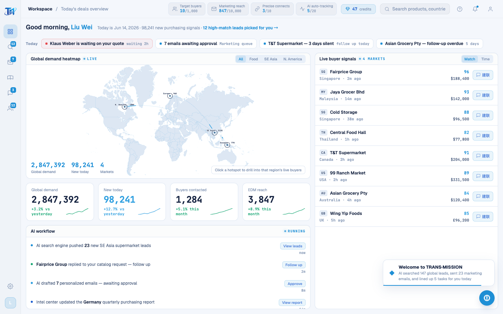

# Round 079 · 🔴 修 R076 严重回归(enterApp 切屏崩) + h1 闸门加固 + #f59e0b 暖橙归一

- 时间:2026-06-26
- 档位:🟦 Standard(`main`;cron 1min)
- 分支:`main`
- backlog 来源项:本轮原取 §8 视觉残留(#f59e0b 暖橙归一);跑闸门时 **h3 揭穿一处 R076 引入的严重回归** → 优先级跃为最高,先修。

## 🔴 严重回归(R076 引入,本轮 h3 抓到)
- **现象**:`enterApp()`(首启「Enter workspace」/window.enterApp 入口)line 813 `document.getElementById('s-onboard').classList.remove('active')` —— **R076 删了 OnboardingScreen(#s-onboard 不再在 DOM)→ getElementById 返回 null → `.classList` TypeError → enterApp 在 line 814(`#s-app` 加 active)之前中止 → 工作台永不显示 → 真实用户走完开头动画点进入后卡死在登录**。
- **为何 R076-R078 没抓到**:h1 闸门末段断言用 `count()`(DOM 存在),AppShell 始终挂载 → count>0 恒真,**没验「可见」**;h3 用 `enterApp()` 包在 `.catch()` 里吞掉异常,直到点热点(需真实 bbox)才以「Element not visible」暴露。两闸门盲区叠加放跑了它。
- **修**:`getElementById('s-onboard')?.classList.remove('active')`(可选链空守)。enterApp 不再中止 → #s-app 正常 active → 工作台显示。

## 🛡 闸门加固(防此类回归复发)
- **h1-golden 加可见性断言**:`#page-dashboard.dash-cc` 不只 `count()` 还查 `.isVisible()`(`工作台真正可见(enterApp 切屏成功)`)。enterApp 中止时 #s-app 不 active → 不可见 → h1 即失败。盲区补上。

## 🎨 视觉残留归一(§8 ④/⑤ 暖橙)
- **`#f59e0b` / `rgba(245,158,11,x)` → 品牌 warning 令牌 `#c8860a` / `rgba(200,134,10,x)`**(4 处全 lock/caution 语义,语义不变只去亮橙 slop):leads `.icp-op-btn.feedback`(Flag mismatch 钮)· `.cpool-status-dot.no-reply` · 情报锁定行挂锁 SVG stroke · 情报 Unlock 钮(bg/color/border)。
- 全站再扫:无其它 off-token 暖橙残留(255,255,255 命中为白色,非暖)。

## 验收
- **build** ✓ · **h3** ✓(**rows=4 · 工作台真渲染 · conversation seeded**,回归已修)· **h1** ✓(含新可见性断言 visible=true)· **tour-check** ✓ · **机检 intel** 零错✓
- **实拍 h3-t0**:工作台完整渲染(地图/KPI/feed/买家/欢迎 toast)—— 入口恢复。
- **两北极星裁决**:产品 —— **修复致命入口崩**(否则整个 app 进不去);视觉 —— 暖橙归一更冷静一致。**KEEP。**

## 截图
- (工作台恢复)

## 教训(append §10 候选)
- **删 live 引用的 DOM 节点(R076 删 #s-onboard)必须 grep 所有 getElementById 引用并空守/清理**;`enterApp` 这种入口函数尤其。
- **闸门断言要验「可见」不只「DOM 存在」**;`count()>0` 对常挂载组件恒真,放跑「挂载但隐藏」。

## commit / 分支 / push
- commit on `main` · push origin main。**cron 1min 起搏,不 ScheduleWakeup。**
