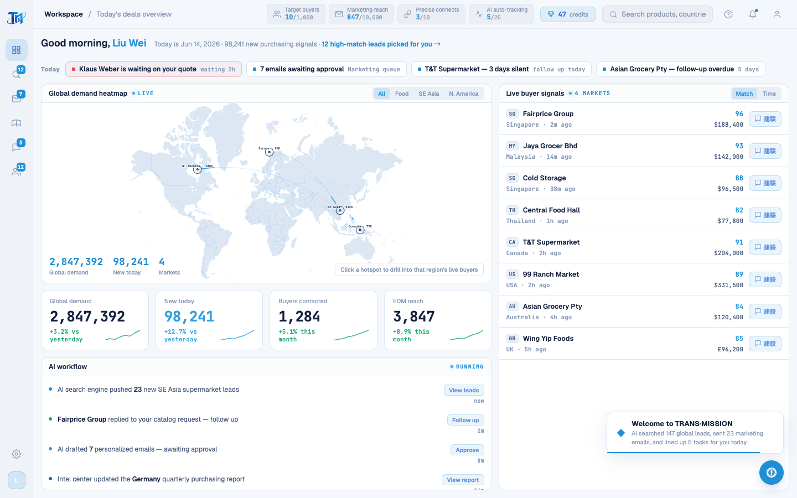

# Round 080 · 🟦 Utility/安全 · 消除 R079 footgun 类:startScan 死尾切除 + render 空守

- 时间:2026-06-26
- 档位:🟦 Standard/Utility(`main`;cron 1min)
- 分支:`main`
- backlog 来源项:承 R079(enterApp 引用已删 #s-onboard 崩)。本轮做**安全审计**:还有没有别处 live 引用已删 DOM 的同类 footgun → 排查 + 根除。

## 安全审计结论
- **enterApp 调的 7 个 render 全审**:`renderAiReport/renderTodayTodo/renderAiDailyReport`(目标 #ai-report-list 等已 R066 并入 DashboardPage)+ `renderPoolPage` —— **均有 `if(!el) return` 空守**(并入后变安全 no-op,不崩)。`renderWaContacts/renderMktList` 无守但目标 DOM(wa-contact-list/mkt-list)仍挂载 → 无活 bug。**无遗留 R079 类活 bug。**
- **footgun 源头 = startScan 死尾**:`if(window.__showAnalysis){…return}` 之后整段(旧 reg-scan-overlay 假扫描 + 章节)死代码,引用已删 `#reg-scan-overlay`/`#s-onboard`/`runOnboarding`。永不执行(早 return),但是 R079 同类隐患(若有人删 early-return 即崩)。

## 做了什么
- **切除 startScan 死尾**(`legacy-app.js` −64/+6 行):startScan 归约为纯 live 体(取 domain → 隐藏网址弹窗 → `window.__showAnalysis(domain)`)。**移除所有对已删 DOM(#reg-scan-overlay/#s-onboard/rso-*)+ runOnboarding 的 live 引用。**
- **防御性空守**:`renderWaContacts`/`renderMktList` 加 `if(!list) return`(与 renderAiReport 等兄弟函数一致,杜绝未来同类 footgun)。
- **验证根除**:全 legacy grep `getElementById('s-onboard'|'reg-scan-overlay'|'rso-…')` → 仅剩 enterApp 那一处 `?.` 空守(R079 已修)。**live 代码再无对已删 DOM 的引用。**

## 残留(orphan,本轮不动 —— 非活 bug)
- `runOnboarding`/`OB_CHAPTERS_MAP`/`advanceOb`/`startAnalysis`/`goStep` 现 **0 live 调用**(死尾切除后彻底孤立),但其块与 canvas 地图辅助函数(initMapCanvas/drawMap/drawArc/getBezier/launchArc…)**交错**,需逐个甄别 live/dead → 留待专轮谨慎删。+ LoginScreen `.rso-*` 隐藏 markup + onboarding.css(同前)。

## 验收
- **build** ✓ · **h1** ✓(含 R079 加的可见性断言 **visible=true**)· **h3** ✓(rows=4)· **tour-check** ✓ · **机检 login** 零错✓
- net −58 行死代码。
- **两北极星裁决**:产品 —— 根除 R079 类 footgun(入口更稳);代码更整齐;视觉无变。**KEEP。**

## 截图
- (进入后工作台,入口路径干净)

## commit / 分支 / push
- commit on `main` · push origin main。**cron 1min 起搏,不 ScheduleWakeup。**
