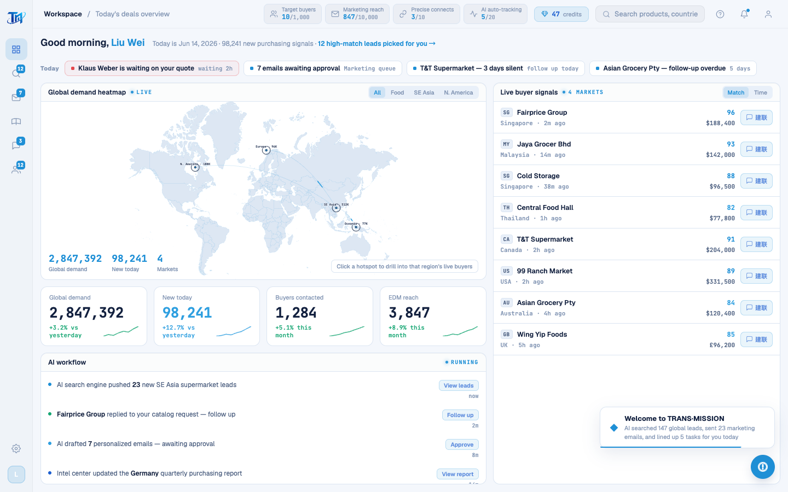

# Round 081 · 🟦 Utility · T11 删整个死 onboarding+canvas 引擎(−455 行,含大块死中文)

- 时间:2026-06-26
- 档位:🟦 Standard/Utility(`main`;cron 1min)
- 分支:`main`
- backlog 来源项:承 R080(切 startScan 死尾后,runOnboarding 簇变 0 live 调用孤儿)。本轮收掉这块孤儿——§8 T11。

## 审计:确认整簇自包含且 0 live 调用
逐符号查 caller(excl 自身定义),确认全簇只能从 `runOnboarding()`(0 live 调用,R080 已断)进入:
- `MAP_REGIONS`/`CITY_LIGHTS`/`CONTINENTS` → 仅 drawMap/isNearActiveRegion/launchArc 用(全死)。
- `initMapCanvas`/`drawMap`/`drawArc`/`getBezier`/`isNearActiveRegion` → canvas 地图(被 SVG WorldHeatmap.vue 取代,死)。
- `OB_CHAPTERS_MAP`/`OB_CONTENTS`/`OB_DURATIONS_MAP`/`advanceOb`/`showObChapter`/`startObCounter`/`launchArc`/`scheduleNext` → 旧章节 onboarding(被 H1 FirstRunAnalysis.vue 取代,死)。
- `obTimer`(enterApp `clearTimeout` 用)声明在簇外(L172)→ **保留**(obTimer=null,clearTimeout 无害)。

## 做了什么
- **删整簇 legacy L248–702**(section header「ONBOARDING MAP ANIMATION ENGINE」→ startObCounter 结束):`legacy-app.js` **2298 → 1843 行(−455)**。一次 perl 行域删除 + 边界/符号复核。
- 删掉的也包含**大块死中文**(OB_CONTENTS 五章市场分析正文、MAP_REGIONS 区域名等)→ legacy 中文行 ~大幅下降。
- 边界复核:删后 `startAnalysis()` 直接接 `// AI Today Report` + `const AI_REPORT_ITEMS`(幸存);10 个死符号 grep 全 0;`node --check` 语法 OK(花括号平衡)。

## 验收
- **build** ✓ · **h1** ✓(visible=true)· **h3** ✓(rows=4)· **tour-check** ✓ · **机检 login + dashboard** 零错✓
- 入口/首启/工作台/下钻全链路无回归(死代码本就不可达,删除零行为变化)。
- **两北极星裁决**:产品 —— 代码大幅变整齐,去掉旧 canvas 地图引擎与死中文;视觉无变。**KEEP。**

## 截图
- (工作台正常)

## 残留 → backlog(T11 尾)
- 死 `AI_REPORT_ITEMS`/`TODAY_TODOS`(中文)+ `renderAiReport`/`renderTodayTodo`(guarded no-op,#ai-report-list 已 R066 并入 Dashboard)+ 它们在 enterApp 的调用 → 可一并删(小)。
- `LoginScreen.vue` `.rso-*` 隐藏 markup + `onboarding.css`(import + 文件)+ `login.css` `.rso-*` 样式。
- `goStep`/`startAnalysis` 孤儿 stub(0 ref,极小)。

## commit / 分支 / push
- commit on `main` · push origin main。**cron 1min 起搏,不 ScheduleWakeup。**
