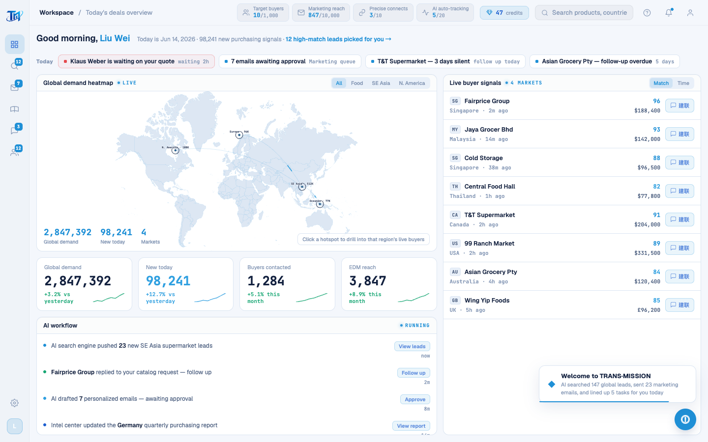

# Round 082 · 🟦 Utility · T11 续:删死 AI 日报/待办/今日报告渲染器(最后一批死中文数据)

- 时间:2026-06-26
- 档位:🟦 Standard/Utility(`main`;cron 1min)
- 分支:`main`
- backlog 来源项:承 R081(删 onboarding+canvas 引擎)。T11 尾:旧 dashboard 右栏面板(R066 已并入 DashboardPage.vue)的 legacy 渲染器 = guarded no-op 死代码。

## 审计:三个面板 ID 全不在 live markup
`grep id="…"` src/:`#ai-report-list` / `#today-todo-list` / `#ai-daily-report` —— **三者均 NONE**(R066 已并入 DashboardPage,旧面板删了)。故:
- `renderAiReport`(→#ai-report-list)· `renderTodayTodo`(→#today-todo-list)· `renderAiDailyReport`(→#ai-daily-report)= 全 `if(!el)return` guarded no-op,**死**。
- `AI_REPORT_ITEMS`(中文)· `TODAY_TODOS`(中文)· `AI_DAILY_ITEMS`(英文,R073 译过但宿主死)= 死数据。
- enterApp 仍调这三个渲染器(no-op)→ 一并清。

## 做了什么(legacy −77 行)
- **删** `AI_REPORT_ITEMS` + `TODAY_TODOS` + `renderAiReport` + `renderTodayTodo`(L249–295,含「AI Today Report & Todo」段)。
- **删** `AI_DAILY_ITEMS` + `renderAiDailyReport`(L1527–1553,含段注释)。
- **删** enterApp 里 `renderAiReport()` / `renderTodayTodo()` / `renderAiDailyReport()` 三行调用。
- **红线**:删的全是 guarded no-op 死渲染器 + 死数据(真实 dashboard 由 DashboardPage.vue 渲染,不受影响)。0 lingering ref,`node --check` OK。
- 顺带清掉**最后一批死中文数据数组**(AI_REPORT_ITEMS/TODAY_TODOS:'新增全球线索'/'Klaus Weber 等待报价回复' 等)→ legacy 中文行 65→55。

## 验收
- **build** ✓ · **h1** ✓(visible=true)· **h3** ✓(rows=4)· **tour-check** ✓ · **机检 dashboard** 零错✓
- enterApp 链路无回归(删的是 no-op);真实工作台「今日待办/AI feed」由 DashboardPage.vue 提供,实拍正常。
- **两北极星裁决**:产品 —— 代码更整齐,去 enterApp 里 3 个 no-op 调用 + 死数据;视觉无变。**KEEP。**

## 截图
- (工作台正常)

## 残留 → backlog(T11 最后一小片)
- `LoginScreen.vue` `#reg-scan-overlay`(`.rso-*`)隐藏 markup(R080 后无任何代码激活它)+ `onboarding.css`(import@index.css + 文件,`.ob-*` 渲染器已 R081 全删)+ `login.css` `.rso-*` 样式 + `goStep`/`startAnalysis` 孤儿 stub。**改 live LoginScreen + 2 css + 删文件,单独一轮谨慎做。**

## commit / 分支 / push
- commit on `main` · push origin main。**cron 1min 起搏,不 ScheduleWakeup。**
