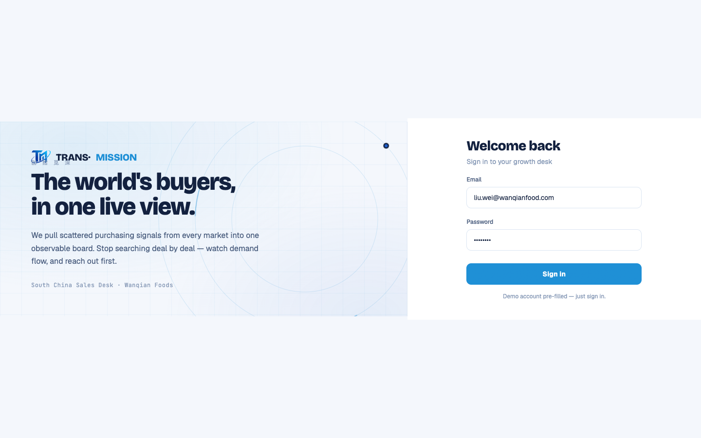

# Round 083 · 🟦 Utility · T11 收尾(rso markup + onboarding.css + stubs)→ T11 全部完成

- 时间:2026-06-26
- 档位:🟦 Standard/Utility(`main`;cron 1min)
- 分支:`main`
- backlog 来源项:T11 最后一小片(承 R082)。本轮清完 → **T11 整项完成**。

## 审计:全部确认死(R080/R081 之后)
- `#reg-scan-overlay`/`.rso-*`:R080 清 startScan 后**无任何 live 代码激活**(legacy 仅剩注释;polish.css 共享选择器里 1 个无害 token)。LoginScreen.vue 里是隐藏 markup(display:none),从不显示。
- `onboarding.css .ob-*`:R081 删光所有 `.ob-*` 渲染器(runOnboarding/showObChapter)→ 类全无消费者。
- `login.css` 内 `logoPulse`/`iconPulse` keyframes:grep 确认仅 .rso-logo/.rso-step-icon 用(死),无外部引用。
- `goStep`/`startAnalysis` stub:0 ref。

## 做了什么(5 文件,−156 行)
- **LoginScreen.vue**:删 `#reg-scan-overlay`(`.rso-*`)隐藏 markup 块 + 修正过期注释(去掉 `#reg-scan-overlay` 提及)。
- **login.css**:删整段 scanning-overlay 样式(`#reg-scan-overlay` + 全部 `.rso-*` + logoPulse/iconPulse keyframes,82–103)。
- **onboarding.css**:**删除文件** + `index.css` 去掉 `@import './onboarding.css'`。
- **legacy-app.js**:删 `goStep`/`startAnalysis` 孤儿 stub。
- **红线**:全是不可达死代码;`login.css logoPulse/iconPulse` 仅 rso 用,随之删。

## 验收
- **build** ✓ · **h1** ✓(visible=true,login 是首屏,直接验证)· **h3** ✓(rows=4)· **tour-check** ✓ · **机检 login** 零错✓
- **实拍 login**:轨道信号母题(R077)+ 品牌 + 表单完整,rso 删除零可见影响(本就隐藏)。
- **两北极星裁决**:产品 —— 代码彻底整齐(死扫描屏/死 css/死文件全清);视觉无变。**KEEP。**

## 截图
- 

## 🏁 里程碑:T11 删死代码 全部完成(R076→R083)
- R076 orphan `src/data/*` + OnboardingScreen.vue · R080 startScan 死尾 + render 空守 · R081 onboarding+canvas 引擎(−455) · R082 死 AI 渲染器(−77) · R083 rso/onboarding.css/stub(−156)。
- 全程 build + h1(R079 加 visible 断言)/h3/tour/机检 绿,**live app 零回归**。`legacy-app.js` 由 2298 → ~1760 行。
- 极小残留(无害):polish.css 共享选择器里死 token `.rso-pct`/`.ob-kpi-val`(改 comma-list 有风险,留)。

## commit / 分支 / push
- commit on `main` · push origin main。**cron 1min 起搏,不 ScheduleWakeup。**
