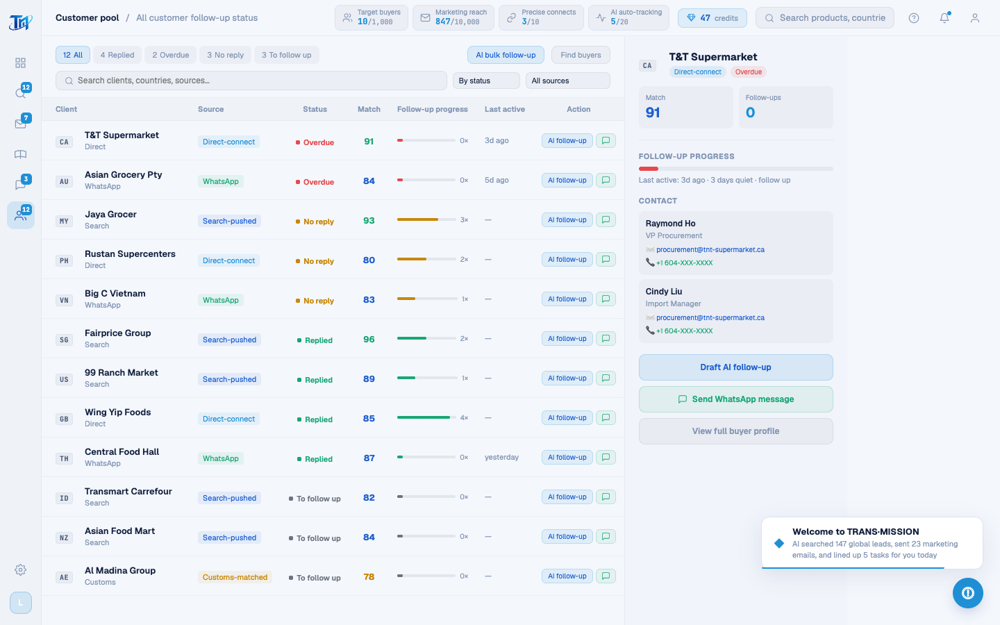

# Round 084 · 🟦 产品轴 · 视觉 QA 抓到漏译:客户池 PoolPage 表头/筛选全英文 + 修源筛选 bug

- 时间:2026-06-26
- 档位:🟦 Standard(`main`;cron 1min)
- 分支:`main`
- backlog 来源项:焦点 ① 全站英文。**视觉 QA**(R079 修好 enterApp 后,verify.mjs 终于能进内屏截图)逐屏复查 → 抓到客户池整屏 chrome 仍中文 + 一处筛选 bug。

## 为什么之前漏了(R074 误判)
- R074 grep 的是 `CustomerPoolPage.vue`——**该文件根本不存在**(grep 返 0 → 误判「池 0 中文」)。真实 live 组件是 **`PoolPage.vue`**(AppShell:18/32 导入渲染),其表头/筛选/搜索 markup 从未译。
- **教训**:别信文件名猜测的 grep;**实拍渲染每屏**才是真验收(本轮正是实拍抓到)。

## 做了什么(PoolPage.vue 全屏 chrome → 英文)
- **筛选 tab**:All / Replied / Overdue / No reply / To follow up(状态键 all/replied/overdue/no-reply/pending 不变)。
- **按钮**:AI bulk follow-up / Find buyers。
- **搜索**:Search clients, countries, sources…。
- **排序**:By status / By match / By name / By last active。
- **来源筛选**:All sources + 4 选项。**🔴 红线修 bug**:选项 value 原是旧中文组名(`搜索推送客户`…),但 R074 已把 CPOOL_DATA group 译成英文(Search-pushed…)→ `renderPoolTable` L774 `i.group === filterSource` 永不匹配,**来源筛选此前是坏的**。本轮把 value+label 一并改成英文组名(Search-pushed/Direct-connect/WhatsApp/Customs-matched)→ **既译又修好筛选**。
- **7 表头**:Client / Source / Status / Match / Follow-up progress / Last active / Action。
- **空态**:Click a client on the left to see details。

## 全站终验(实拍每内屏)
- **intel / marketing / pool / leads** 实拍复查:除 pool 外全英文且布局正常(英文较长无溢出/截断)。pool 修后实拍全英文。
- 其余组件残留中文 = **仅注释 + DashboardPage 的 `region:'东南亚'` 内部匹配键**(R066 设计,regionLabel 映射英文显示,不可见)。**全站 live 面 0 可见中文。**

## 验收
- **build** ✓ · **机检 pool** 零错✓ · **h1** ✓ · **h3**(rows=4)✓ · **tour-check** ✓
- **实拍 pool**:表头/筛选/搜索/tab/按钮/详情面板全英文。
- **两北极星裁决**:产品 —— 补齐最后一处可见中文 + 修好来源筛选(真功能);视觉无变。**KEEP。**

## 截图
- 

## commit / 分支 / push
- commit on `main` · push origin main。**cron 1min 起搏,不 ScheduleWakeup。**
