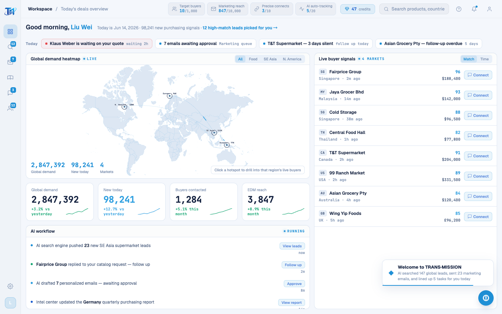

# Round 085 · 🟦 闸门加固 · verify.mjs 加「渲染中文检测」守卫(自动化 R084 抓漏)+ 修 dashboard 建联钮

- 时间:2026-06-26
- 档位:🟦 Standard(`main`;cron 1min)
- 分支:`main`
- backlog 来源项:承 R084(实拍抓到 pool 漏译,但靠肉眼)。R084 教训 = 漏译靠人眼漏 10 轮。本轮**把检测自动化**,根治此类。

## 做了什么
### 1. verify.mjs 加渲染中文守卫(闸门加固)
- 每屏截图后扫 `document.body.innerText`(**只含可见文字**,自动忽略 display:none 的隐藏模态 + JS 数据键如 `region:'东南亚'`(regionLabel 映射英文显示,不进 innerText))。
- 命中 `[一-鿿]` 即记入 `verdict.chinese`,**非空则 `pass:false`**(硬闸门)。允许清单:`创拾觅深`(登录品牌署名,刻意保留)。
- 效果:**任何屏/模态出现可见中文 → 机检直接红**。R084 那种「整屏 chrome 漏译」以后秒抓,不再靠人眼。

### 2. 守卫即抓到一处真漏译 → 修
- **dashboard 买家行「建联」钮**(`DashboardPage.vue:188` `<button class="bconnect">…建联`,title `一键建联`)—— R066 漏掉(SVG 旁的小内联钮,grep/肉眼都易漏)→ 改 **Connect** / title **Connect in one click**。
- 红线:仅改可见文案,`@click="connect(b)"` H3 建联处理函数不动。

## 全站终验(守卫跑遍 16 屏/态,全 `chinese:[]`)
- 屏:login(创拾觅深 allowlist→[])· dashboard(修后[])· leads · intel · marketing · pool · whatsapp —— 全 []。
- 态:feedback · unlockm · leadsrg · intelunlock · waunlock · waentry · tour · nudge —— 全 []。
- **全站 live 面(含所有模态/交互态)0 可见中文,且现在由机检自动守住。**

## 验收
- **build** ✓ · **机检 dashboard** `pass:true · chinese:[] · newErrors:[]`✓ · 16 屏/态守卫全 []✓ · **h1** ✓ · **h3**(rows=4,建联流程不破)✓ · **tour-check** ✓
- **两北极星裁决**:产品 —— ① 全站英文从「我都译了」升级为「闸门保证」;补最后一处可见漏译;视觉无变。**KEEP。**

## 截图
- (dashboard 建联→Connect)

## 教训(append §10)
- **可见文案验收靠机检扫 innerText,别靠肉眼/猜测 grep**(R084 漏 10 轮 + R066 漏单钮,都因人工)。innerText 天然只含可见文字、忽略隐藏模态与 JS 数据键,最适合做「可见中文=0」硬闸门。

## commit / 分支 / push
- commit on `main` · push origin main。**cron 1min 起搏,不 ScheduleWakeup。**
