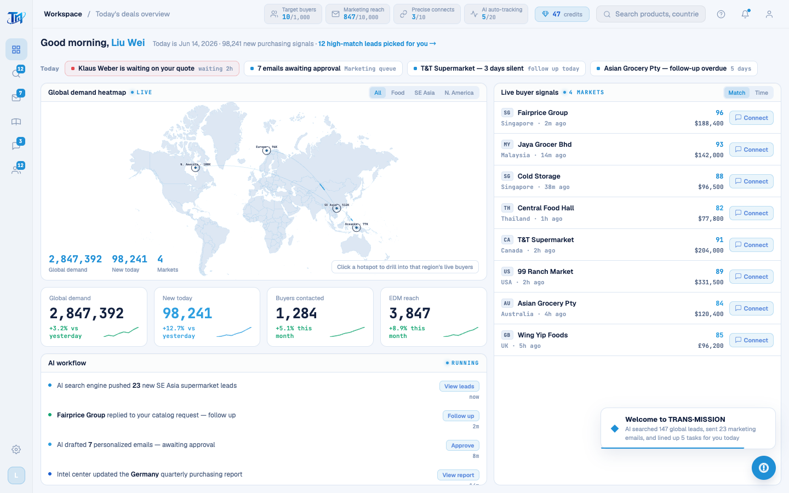
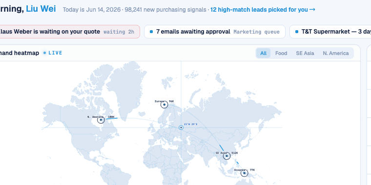

# Round 090 · 🟦 Standard · 地图雷达准星 HUD(新焦点:科技感 + 交互感 + 一点点游戏感)

- 时间:2026-06-26 / 档:Standard(自动落库) / 分支:main
- backlog 来源:用户 2026-06-26 新方向「再多一点科技感 + 地图要有交互感,甚至一点点游戏感」(loop 收敛后由 /loop 指令给出新焦点)

## 做了什么
WorldHeatmap.vue 加**跟随指针的雷达准星 HUD**:鼠标在地图上移动 → azure 十字准星 + 目标环 + **真实经纬读数**(等距圆柱近似把指针位置换算成 lat/long,如 `15°N 29°E`)。
- 任务控制台 / 信号台交互感:被动地图(仅点热点有反应)→ 全图随指针响应。
- **零额外 slop**:`v-if="cursor"` 闲置不渲染 → 静态画面零装饰,不影响截图高级感;单一 azure、细 mono、无 glow/渐变/emoji。
- **不挡热点**:reticle 组 `pointer-events:none`,H3 热点点击/下钻不受影响。
- 坐标是**指针真实位置换算**,非造假数据(守红线)。

## 验收
- build ✓ · h1(visible=true)✓ · h3(rows=4 建联流程不破)✓ · i18n 17 屏 chinese:[] ✓
- reticle 实测:Playwright 驱动 mousemove over `.cc-map svg` → `.wh-reticle` count=1,`.wh-coord` 文本 `15°N 29°E`(确证渲染 + 读数计算正确)
- 两北极星自检:① 视觉(零 AI 味/高级)= 闲置无痕、悬停是干净终端准星,敢进预售 PDF → KEEP;② 产品(交互/科技/游戏感)= 真交互 + 真坐标,强化「live signal room」→ KEEP

## 截图

## 残留 → backlog(下轮候选,延续新焦点)
- 热点 hover/选中升级为「目标锁定」角括号(game targeting 视觉),配合准星
- 准星靠近热点时吸附/高亮该热点(snap-to-target 游戏感)
- 全图缓慢雷达扫掠光束(持续 tech 氛围,极克制)
- 地图轻微视差/倾斜随指针(depth,谨慎防 slop)
- 十字线 opacity .3 偏淡,可视情况微调到 .35-.4 让交互更可读

## commit / push
main · 见下一条 commit hash
