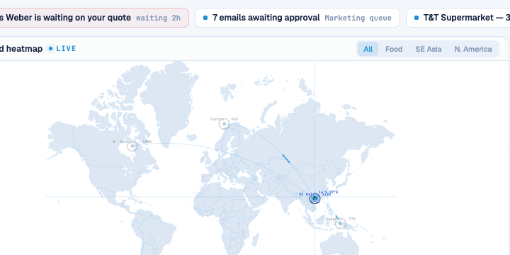

# Round 091 · 🟦 Standard · 热点目标锁定角括号(承 R090,延续科技/交互/游戏感焦点)

- 时间:2026-06-26 / 档:Standard(自动落库) / 分支:main
- backlog 来源:R090 残留顶项「热点 hover/选中升级目标锁定角括号(game targeting)」

## 做了什么
WorldHeatmap.vue 给每个可点热点加**目标锁定角括号**(4 个 L 形角,围成相机对焦 / 游戏锁定框):
- **平时隐**(opacity 0);**hover** 淡入(.9);**选中(下钻该区)= 锁定**:royal 蓝 + `wh-lock-in` snap 动画(scale 1.5→1,cubic-bezier 弹入)。
- 与 R090 准星 HUD 同框composes:点热点后指针停留 → 十字准星 + 经纬读数 + 锁定括号叠成完整 targeting HUD。
- **零 slop**:仅 hover/选中可见(静态无痕)、单 azure/royal、细 stroke、无 glow/渐变;`transform-box:fill-box;transform-origin:center` 让 snap 绕热点中心缩放。reduce-motion 关动画。

## 验收
- build ✓ · h1(visible=true)✓ · h3(rows=4 建联不破)✓ · i18n pass:true ✓
- 锁定实测:Playwright 点首个 `.wh-spot[role=button]` → `.wh-spot.sel` count=1 且 `.sel .wh-lock` count=1(确证选中态括号渲染);截图见 SE Asia 选中锁定 + 他区 dim
- 两北极星自检:① 视觉=克制干净 targeting reticle,敢进 PDF → KEEP;② 产品=下钻有「锁定」即时正反馈(成就感)+ 游戏 targeting 感 → KEEP

## 截图

## 残留 → backlog(延续焦点)
- 准星吸附最近热点(snap-to-target:指针靠近时准星滑向热点中心)
- 全图克制雷达扫掠光束(持续 tech 氛围)
- 地图轻微视差/倾斜随指针(depth,谨慎)
- 热点 hover 时显示迷你 tooltip(该区实时买家数/最高匹配)

## commit / push
main · 见下一条 commit hash
