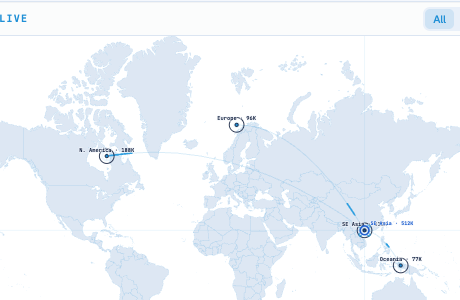

# Round 092 · 🟦 Standard · 准星磁吸 snap-to-target(承 R090/R091,延续科技/交互/游戏感焦点)

- 时间:2026-06-26 / 档:Standard(自动落库) / 分支:main
- backlog 来源:R091 残留顶项「准星吸附最近热点(snap-to-target)」

## 做了什么
WorldHeatmap.vue 给雷达准星加**磁吸锁定**:指针进入热点 42 viewBox 单位(≈23 屏幕 px)半径 → 准星**滑向并锁定**该热点中心。
- **锁定态**:十字线让位(opacity .14),准星环收紧成 royal 锁定环,读数由经纬切成**热点标签**(如 `SE Asia · 512K` = target acquired),并**点亮该热点的目标括号**(复用 R091 `.wh-lock`,新增 `.snap` 触发)。
- 准星环 `transition: cx/cy .12s` → 吸附是平滑滑入而非瞬跳(游戏锁定手感)。
- **双重价值**:游戏 targeting 感 + 热点更易点中(磁吸辅助)+ 锁定即显区域名(信息)。
- **零 slop**:仍仅 hover 可见、单 azure/royal、无 glow/渐变;坐标/标签皆真实。

## 验收
- build ✓ · h1(visible=true)✓ · h3(rows=4 建联不破)✓ · i18n pass:true ✓
- **磁吸实测**:Playwright 把鼠标移到首个热点中心**旁 9px** → `.wh-reticle.locked=true`、`.wh-retic-ring` cx=778 **正好等于**该热点 `translate(778,398)` 的 x(确证吸附到中心)、读数=`SE Asia · 512K`、该 spot `.snap` 类=true(括号点亮)
- 两北极星自检:① 视觉=干净 target-acquired 锁定态,敢进 PDF → KEEP;② 产品=磁吸游戏感 + 更易操作 + 锁定显区域名 → KEEP

## 截图

## 残留 → backlog(延续焦点)
- 全图克制雷达扫掠光束(持续 tech 氛围)
- 锁定时轻微触感:热点 ping 同步一闪(target-acquired 脉冲)
- 地图轻微视差/倾斜随指针(depth,谨慎防 slop)
- 热点 hover tooltip 扩展(除标签外加最高匹配买家/最新信号时间)

## commit / push
main · 见下一条 commit hash
