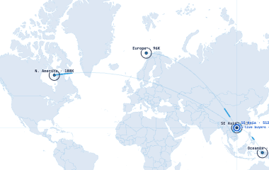

# Round 093 · 🟦 Standard · 锁定情报读数 lock-on intel(承 R090-092,延续焦点 + 喂产品轴「看不懂的数字」)

- 时间:2026-06-26 / 档:Standard(自动落库) / 分支:main
- backlog 来源:R092 残留「hover tooltip 扩展」+ §8b 产品轴「数字可读性:去看不懂的数字」

## 做了什么
把 R092 的锁定读数从单行区域标签升级为**两行真实情报 chip**:
- 行1(标题):区域标签 `SE Asia · 512K`(royal 粗体)
- 行2(情报):`4 live buyers · top 96%`(muted mono 小字)—— **真实数据**:该区买家数 + 最高匹配度,从 hotspot 数据带入(DashboardPage liveHotspots 新增 `topMatch`,count 已有)。
- scan → 磁吸锁定 → **读到该区实时情报**:把地图做成可交互情报控制台(科技+交互+游戏感),且让数字「有意义」(回应产品轴「看不懂的数字」)。
- **零 slop**:无背景 rect/面板,沿用 wh-coord 白 halo 保可读;仅锁定时显;单 azure/royal/muted;数据全真。

## 验收
- build ✓ · h1(visible=true)✓ · h3(rows=4 建联不破)✓ · i18n pass:true ✓
- **情报实测**:Playwright 鼠标移到首热点旁 8px → `.wh-reticle.locked=true`、`.wh-coord-title`=`SE Asia · 512K`、`.wh-intel`=`4 live buyers · top 96%`(4=东南亚真实买家数,96%=Fairprice 真实 mt)
- 两北极星自检:① 视觉=克制 2 行 mono chip 无面板 slop,敢进 PDF → KEEP;② 产品=锁定即读真实区域情报,数字有上下文 + 控制台交互感 → KEEP

## 截图

## 残留 → backlog(延续焦点)
- 锁定时热点 ping 同步一闪(target-acquired 脉冲反馈)
- 全图克制雷达扫掠光束(持续 tech 氛围,谨慎防 slop)
- 地图轻微视差/倾斜随指针(depth)
- 情报行可加「最新信号时间」(buyers sub 里的 2m ago / 14m ago)

## commit / push
main · 见下一条 commit hash
