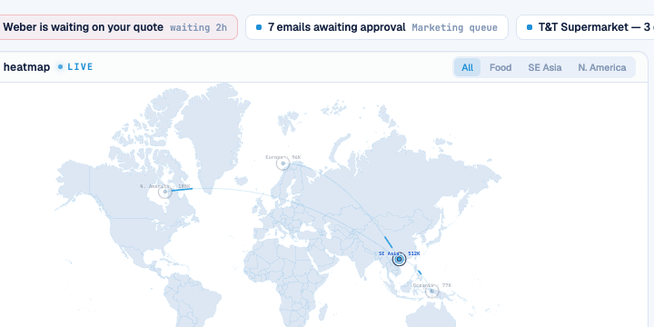

# Round 095 · 🟦 Standard · 地图↔买家列表双向联动(新交互维度,非 targeting 微 polish)

- 时间:2026-06-26 / 档:Standard(自动落库) / 分支:main
- backlog 来源:R094 收敛观察「下轮起拓宽」。**审计修正**:纯「广度复用」N/A —— LeadsPage 无地图(只搜索图标);FRA 用 WorldHeatmap 但 hotspots 无 region(刻意非交互展示,且已自动继承游标准星)。故转**新交互维度**。

## 做了什么
建立**地图↔列表双向联动**(此前只有 map→list:点热点筛选列表):
- **list→map**:hover 某买家行 → 地图上其区域**软高亮**(点亮环+放大点)+ 其它区域 dim。强化「这个买家在哪」的空间联动 + live 感。
- WorldHeatmap 新增 `highlight` prop(比 `active` 轻:**不**触发括号/锁定脉冲,避免逐行 hover 噪声);DashboardPage 加 `hoverRegion` ref + 买家行 `@mouseenter/leave`,`:highlight="hoverRegion"`。
- **零 slop**:复用既有 dim/高亮视觉语言,无新增装饰;`active`(点击下钻)优先于 `highlight`,语义不冲突。

## 验收
- build ✓ · h1(visible=true)✓ · h3(rows=4 建联不破)✓ · i18n pass:true ✓
- **联动实测**:Playwright hover 首行(`SG Fairprice Group`=东南亚)→ 地图 `hl` 命中 1 个、`dim` 3 个(4 热点);截图见 SE Asia 点亮、他区淡出
- 两北极星自检:① 视觉=复用既有高亮语言,克制无 slop,敢进 PDF → KEEP;② 产品=新双向联动,空间感 + 更强 live 交互 → KEEP

## 截图

## 残留 → backlog
- 反向补全:hover 地图热点(非点击)也软高亮 → 对应买家行高亮(map→list hover 镜像)
- 情报行加最新信号时间(产品价值)
- FRA/Leads 地图广度已确认 N/A(记录在案,别重复审计)
- ⚠️ 收敛:地图交互已很完整(scan/snap/intel/确认/双向联动);若下轮无明显高价值地图项,转其它屏 tech 感审计 or 发 digest

## commit / push
main · 见下一条 commit hash
