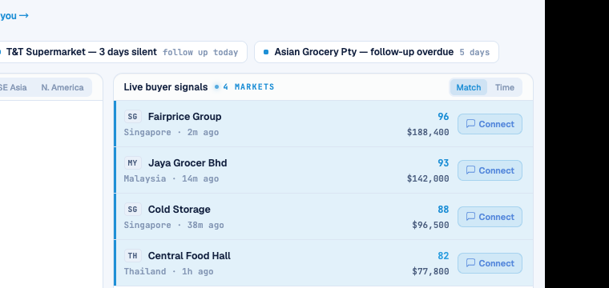

# Round 096 · 🟦 Standard · 地图→列表反向联动(双向 hover 联动闭合)

- 时间:2026-06-26 / 档:Standard(自动落库) / 分支:main
- backlog 来源:R095 残留顶项「反向补全:hover 地图热点 → 高亮对应买家行」

## 做了什么
补上 R095 的镜像方向,**双向 hover 联动闭合**:
- **map→list**(本轮):磁吸锁定某地图区域 → 该区所有买家行点亮(azure 左标 `inset 3px` + `--acc-soft` 浅 tint)。
- 之前 list→map(R095)+ 现在 map→list = 完整双向:hover 任一侧,另一侧对应高亮。
- WorldHeatmap 新增 `hover` emit(磁吸锁定区域变化时广播,带去重 lastHover 避免每帧触发);DashboardPage 加 `mapHoverRegion` ref + `@hover` + 买家行 `.row-focus` class。
- **零 slop**:复用 `--acc`/`--acc-soft` 令牌,左标+浅 tint 克制;仅 hover 瞬时,静态无痕。

## 验收
- build ✓ · h1(visible=true)✓ · h3(rows=4 建联不破)✓ · i18n pass:true ✓
- **镜像实测**:Playwright 鼠标移到 SE Asia 热点 → `.brow.row-focus` 命中 4 行(Fairprice/Jaya Grocer/Cold Storage/Central Food Hall,全东南亚)/ 共 8 行;截图见 4 行 azure 左标+tint
- 两北极星自检:① 视觉=克制左标+tint 复用令牌,敢进 PDF → KEEP;② 产品=双向空间联动闭合,更强 live 交互感 → KEEP

## 截图

## 残留 → backlog
- 情报行加最新信号时间(buyers sub 的 2m/14m ago)— 产品价值,地图最后一个明显项
- ⚠️ **收敛信号**:地图交互已完整(scan/snap/intel/确认脉冲/双向联动)。R090-096 连 7 轮地图,均真值但边际递减将至。**下轮做完情报时间后,转其它屏 tech 感审计 or 发 digest 问方向**(避免在单组件过度打磨,触发 §收敛 K=3 规则)。

## commit / push
main · 见下一条 commit hash
