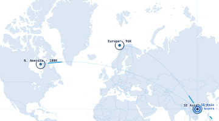

# Round 097 · 🟦 Standard · 锁定情报加「最新信号时间」(地图焦点收官)

- 时间:2026-06-26 / 档:Standard(自动落库) / 分支:main
- backlog 来源:R096 残留「情报行加最新信号时间」—— 地图焦点最后一个明显项

## 做了什么
锁定情报 chip 从「数 + 匹配」补全为**完整三元**:`4 buyers · 96% · 2m ago`(多少 / 多好 / 多新)。
- DashboardPage liveHotspots 新增 `latest`(该区最近一条信号时间,从 buyers[0].sub 取 `· 2m ago`)。
- WorldHeatmap intel 串补 recency,顺手压缩(`live buyers`→`buyers`、`top 96%`→`96%`)防溢出。
- 卖方锁定某区即知:该区有几个活跃买家、最高匹配多高、最近一条多新 → 完整「该不该现在跟进」判断,彻底回应产品轴「看不懂的数字」。
- **零 slop**:仍 2 行无面板、白 halo、仅锁定显、数据全真。

## 验收
- build ✓ · h1(visible=true)✓ · h3(rows=4 建联不破)✓ · i18n pass:true ✓
- **实测**:Playwright 锁 SE Asia → `.wh-intel`=`4 buyers · 96% · 2m ago`(4 真实买家数、96% Fairprice 真实 mt、2m ago 该区最近信号)
- 两北极星自检:① 视觉=紧凑 mono 读数不溢出,敢进 PDF → KEEP;② 产品=完整情报三元,数字全有意义 → KEEP

## 截图

## 🏁 地图焦点收官(R090-097,8 轮)
scan 准星(经纬)→ 目标括号 → 磁吸 snap → 确认脉冲 → 情报读数(数/匹配/时间)→ 双向 hover 联动。dashboard 地图已是完整可交互雷达情报控制台。

## 残留 → backlog(**下轮起转其它屏 tech 感**)
- 其它屏 tech/交互审计:LeadsPage(搜索/列表交互)· IntelPage · WhatsApp · MarketingPage —— 找「被动/死板/缺 live 感」的点
- 候选 tech 母题:列表项 hover 微反馈、KPI/spark 微动、实时 feed 流入动效(均须克制、绑真实、防 slop)
- 若审计无明显高价值项 → 发 digest 问方向

## commit / push
main · 见下一条 commit hash
