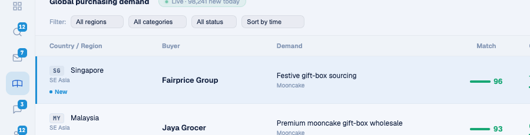

# Round 098 · 🟦 Standard · Intel 终端交互一致化(地图后首个其它屏 · tech 感审计)

- 时间:2026-06-26 / 档:Standard(自动落库) / 分支:main
- backlog 来源:R097 收官后转其它屏。**全屏 tech 审计**(leads/intel/marketing/whatsapp 实拍):marketing(邮件队列)/whatsapp(三栏聊天)已成熟;**多数「● Live」指示已在脉冲**(dashboard/leads/FRA/login),唯 Intel 一处静态;Intel 表是最数据密的「终端」屏但行 hover 几乎不可见。

## 做了什么
把 Signal-Room 交互语言带到 Intel 终端(纯 Vue 模板/CSS,**不碰 legacy renderIntelTable 逻辑**):
1. **行 hover 一致化**:`.intel-tr:hover` 从几乎不可见的 `rgba(19,33,63,.04)` → azure inset 左标 `inset 3px var(--brand)` + 浅 azure tint(**复用 dashboard `row-focus`/地图联动同款语言**),密表变「可响应终端」。
2. **Live 徽标补脉冲**:Intel「● Live · 98,241 new today」的静态 `●` → 脉冲圆点(对齐全站 login/leads/dashboard 的 live-dot,`animation:pulse`),诚实表达「在 live」。

## 验收
- build ✓ · h1(visible=true)✓ · h3(rows=4 建联不破)✓ · i18n pass:true ✓
- **实测**:Playwright 进 intel,hover 首行 → `getComputedStyle(boxShadow)!=='none'`(左标生效);live 徽标 dot `animationName=pulse`(脉冲生效);截图见 Fairprice 行 azure 左标+tint
- 两北极星自检:① 视觉=复用既有 azure 语言,克制一致无 slop → KEEP;② 产品=密表可响应 hover + live 诚实脉冲,更强 tech/交互 → KEEP

## 截图

## ⚠️ 收敛信号(重要)
全屏 tech 审计后:**地图焦点已收官(R090-097),其它屏(marketing/whatsapp/leads)基本成熟,live-tell 已全站一致**。本轮已是「补一致性」级别(价值中等)。再自动挖大概率只剩微 polish → **建议:发 digest 问用户下一焦点方向**(候选:首启 FRA 动效深化 / 某屏功能性增强 / 暂停 loop)。下轮若仍无高价值项,降 cadence + 等指示。

## commit / push
main · 见下一条 commit hash
