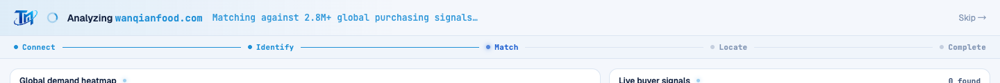

# Round 099 · 🟦 Standard · 首启 FRA 拼装进度脊(新焦点首轮)

- 时间:2026-06-26 / 档:Standard(自动落库,非 Hero 大改) / 分支:main
- backlog 来源:用户 R098 后 AskUserQuestion 选定**新焦点=深做首启 FRA 动画**

## 做了什么
FRA 首启动画原本只有单行循环 status 文字,缺「拼装进度」结构。加 **5 阶段拼装进度脊**(mission-control assembly spine):
- `Connect → Identify → Match → Locate → Complete`,随真实 `stage`(0-4)**逐段点亮**:完成段 azure + 实心点,当前段 royal + 脉冲点,未来段 muted;段间连接线随完成**逐段填充**。
- 真实阶段驱动,**非假 %**(守红线);给首启「指挥台自我拼装」清晰的进度骨架 + 游戏进度感 + 科技/控制台气质。
- **零 slop**:mono 细标 + 单 azure/royal,无 glow(仅 active 点极淡)、无渐变;reduce-motion 关 active 脉冲。

## 验收
- build ✓ · h1(visible=true,走 FRA 全流程)✓ · h3(rows=4)✓ · i18n pass:true ✓
- **进度脊实测**:Playwright 跑首启 —— ~2.2s 时 `.fra-pstep.done`=2、active=`Match`、`.fra-pline.done`=2;~5.8s 时 done=4、active=`Complete`(逐段随真实 stage 推进)
- 两北极星自检:① 视觉=克制 mono 控制台脊,敢进 PDF → KEEP;② 产品=首启进度可见、阶段清晰、游戏进度感 → KEEP

## 截图

## 残留 → backlog(FRA 焦点续)
- 完成时 5 段全亮做一次同步「全锁定」收束闪(target-acquired 收尾)
- 买家流入时与地图区域的连接感(hotspot→buyer row 轻连线,呼应 dashboard 双向联动;cross-pane SVG 风险中,谨慎)
- 「Match」阶段:匹配信号数快速扫动计数(须真实区间,防假 %)
- settle 文案 KPI 收束节奏微调

## commit / push
main · 见下一条 commit hash
