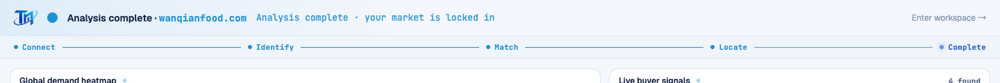

# Round 100 · 🟦 Standard · 首启完成「全锁定」收束扫光(FRA 焦点续)

- 时间:2026-06-26 / 档:Standard(自动落库) / 分支:main
- backlog 来源:R099 残留顶项「完成时 5 段同步全锁定收束闪(target-acquired 收尾)」

## 做了什么
给首启拼装一个**完成climax**:分析完成(stage=4)时,进度脊整条变满 azure + 一道 azure/azure-bright **扫光一次性掠过**整条脊(systems locked 收束)。
- 呼应状态栏「your market is locked in」+ settle 总结,把「指挥台拼装完成」做成有收束感的高潮(成就感/希望 + 一点游戏 target-acquired 味)。
- 一次性(`.locked::after` 单次 animation),`overflow:hidden` 裁在脊内;**零 slop**:单 azure 软扫光,无 glow/无残留;reduce-motion 直接 `display:none` 不扫。

## 验收
- build ✓ · h1(visible=true,走 FRA 全程)✓ · h3(rows=4)✓ · i18n pass:true ✓
- **收束实测**:Playwright 跑到 ~5.5s(完成)→ `.fra-pipe.locked`=true、4 段 done(Complete 为 active)、`::after` animationName=`fra-pipe-sweep-*`(扫光生效);截图见整脊满 azure
- 两北极星自检:① 视觉=克制一次性扫光 + 满 azure 脊,敢进 PDF → KEEP;② 产品=拼装完成有收束高潮,「锁定」感强化 → KEEP

## 截图

## 残留 → backlog(FRA 焦点续)
- 买家流入 ↔ 地图区域连接感(hotspot→buyer row 轻连线;cross-pane SVG 风险中,或留作 Hero 专轮谨慎做)
- Match 阶段:匹配信号数快速扫动计数(须真实区间,防假 %)
- settle KPI 收束节奏微调(数字滚入与扫光同步)
- ⚠️ FRA 已较完整(进度脊 R099 + 收束 R100);再 1-2 轮后评估是否收敛或转向

## commit / push
main · 见下一条 commit hash
