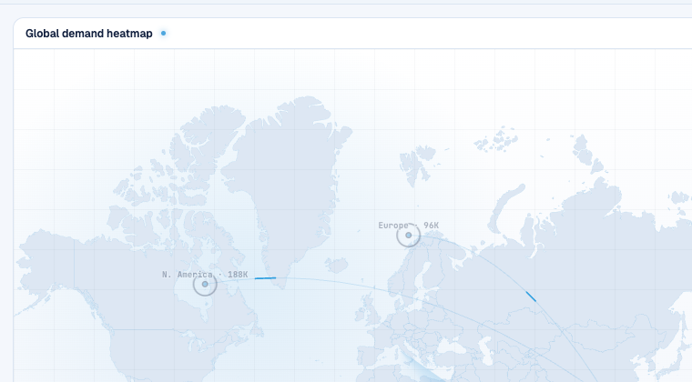

# Round 101 · 🟦 Standard · 首启:买家流入→地图区域聚光(FRA 焦点续)

- 时间:2026-06-26 / 档:Standard(自动落库) / 分支:main
- backlog 来源:R100 残留「买家流入↔地图区域连接感」——**取其安全版**(复用 highlight prop,非 cross-pane SVG 连线)

## 做了什么
让首启地图**随买家到货响应**,把「hot regions → 这些区域的买家流入」叙事显性化:
- FRA hotspots + buyers 各加 region 键(SE/NA/EU/OC);新增 `streamingRegion` computed = 当前最新到货买家的区域(`done` 或未开始时为 null)。
- WorldHeatmap `:highlight="streamingRegion"` → 买家流入时**聚光其来源区域**(点亮环+放大点)、其它区域 dim;聚光随到货在区域间移动,**完成即清空**(settle 时各区平权)。
- **安全选择**:复用 R095 的 `highlight` prop(轻量,不触发括号/脉冲),**不做 cross-pane SVG 连线**(那留作风险更高的 Hero 专轮);避开假计数红线(无新增数字)。

## 验收
- build ✓ · h1(visible=true,走 FRA 全程)✓ · h3(rows=4)✓ · i18n pass:true ✓
- **聚光实测**:Playwright 跑首启 —— ~4.3s(SE 买家流入中)地图 `hl`=1、`dim`=3(SE 聚光、他区暗);完成后 `hl`=0(清空,各区平权)
- 两北极星自检:① 视觉=复用既有聚光语言,克制无 slop → KEEP;② 产品=地图随到货响应,强化区域↔买家叙事 + live 拼装感 → KEEP

## 截图

## 残留 → backlog
- (Hero 专轮候选)买家行↔地图 cross-pane 轻连线(到货时一道连线从区域飞入行;风险中,需谨慎做+可能提分支)
- settle 数字滚入与 R100 扫光节奏同步微调
- ⚠️ FRA 已相当完整(R099 进度脊 + R100 收束扫光 + R101 区域聚光);**下轮建议评估收敛 / 发 digest 问方向**(避免 §K=3 过度打磨)

## commit / push
main · 见下一条 commit hash
