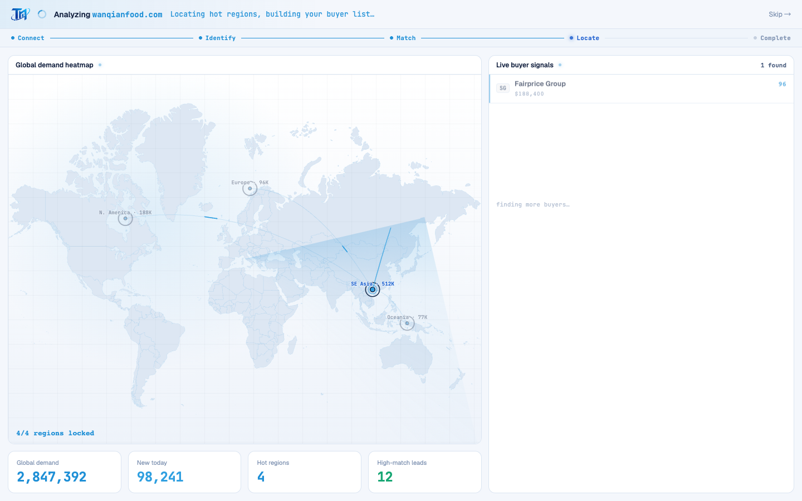
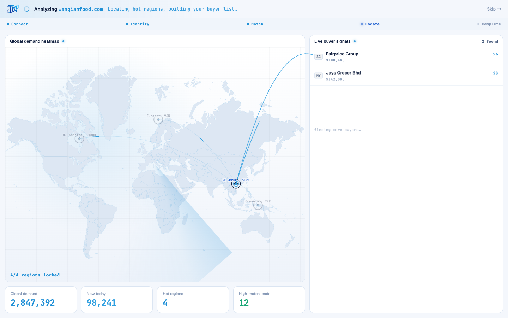
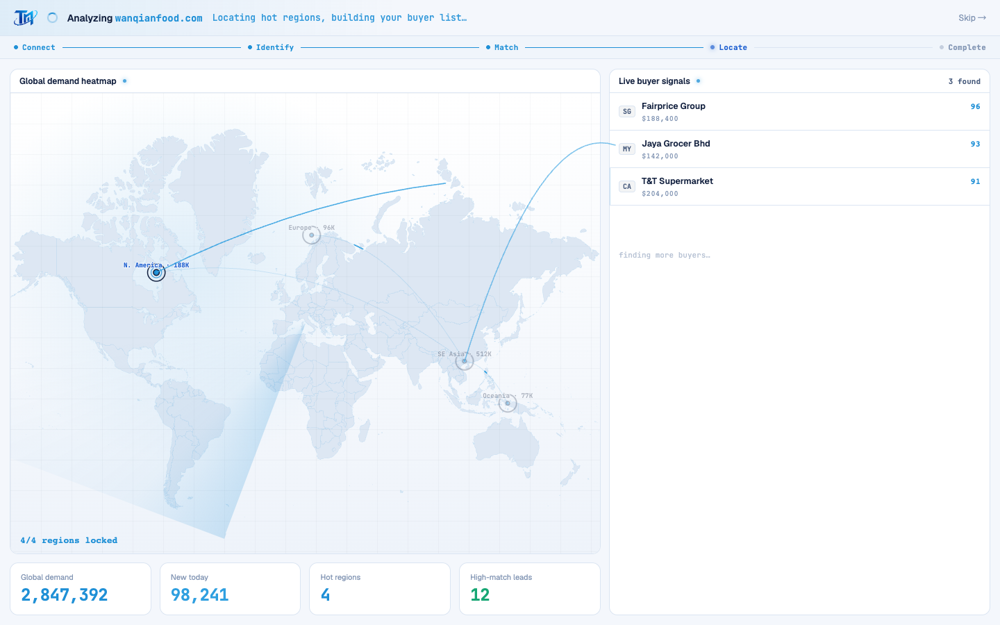

# Round 102 · 🟥 Hero · 首启跨栏信号连线(buyer 从来源区域飞入)

⏸ **需要你 REVIEW** — 分支 `feat/fra-signal-routing`,满意就 merge 到 main(`git merge feat/fra-signal-routing`)。

- 时间:2026-06-26 / 档:Hero(放大模式 · 分支 + 暂停等 review) / 分支:feat/fra-signal-routing
- backlog 来源:R100/R101 残留「买家流入↔地图区域 cross-pane 连线」(用户 R102 AskUserQuestion 选定走 Hero 专轮)

## 做了什么
首启买家流入时,**一道 azure 信号线从其来源区域(地图热点)划弧飞入对应买家行**——把「hot regions → 这些区域的买家」从"聚光提示"升级为"看得见的信号路由",最强的 wow/游戏感。
- 覆盖层 `svg.fra-wire` 铺在 `.fra-ws` 上(px 坐标,无 viewBox);`spawnWire(region,row)` 用 WorldHeatmap svg 的 `getScreenCTM()` 把热点 viewBox 坐标换算到屏幕,减去 `.fra-ws` rect → 起点;买家行 `getBoundingClientRect` → 终点;二次贝塞尔上凸弧。
- `watch(buyerN)`:每有买家到货 → `nextTick` 取该行 → 从其 region 热点射线;线 `pathLength=1` + dashoffset 绘入(信号飞行)随即淡出,~1.15s 后移除。
- 叠加 R101 区域聚光:到货区域既被聚光、又有信号线飞入,叙事闭合。
- **零 slop**:单 azure 细弧、绘入即淡出(非常驻)、pointer-events 关;reduce-motion 完全不生成连线。**真实**:线连的是真实买家↔真实来源区域。

## 验收
- build ✓ · h1(visible=true,走 FRA 全程)✓ · h3(rows=4)✓ · i18n pass:true ✓
- **连线实测**:Playwright 跑首启,在买家到货窗口采样 → `.fra-wire-path` 最多同屏 2 条(快速到货并发);三帧序列见信号线从 SE Asia 热点飞入 Fairprice/Jaya 行
- delight 自评(Hero 两轴):wow=信号路由强直观、游戏感足;克制=单 azure 绘入即逝无 glow/无残留 → 自评 KEEP,**待你定夺**

## 截图(三帧序列)

## 风险 / review 关注点
- cross-pane 坐标依赖运行时 rect/CTM:窗口尺寸/布局变化时即时计算,已每次重算;极端窄屏(<880 单列)未专门适配(首启本就桌面向)。
- 同屏并发连线上限自然由到货节奏(450ms)约束,实测≤2,无堆积。

## 状态:⏸ 暂停等 review(Hero 协议)
- 本轮**不 merge 到 main**;已 push 分支 `feat/fra-signal-routing`。
- **已暂停 cron 循环**(避免在待 review 的分支上继续自动跑)。review 满意 merge 后,告诉我或重启 `/loop` 即可继续。
